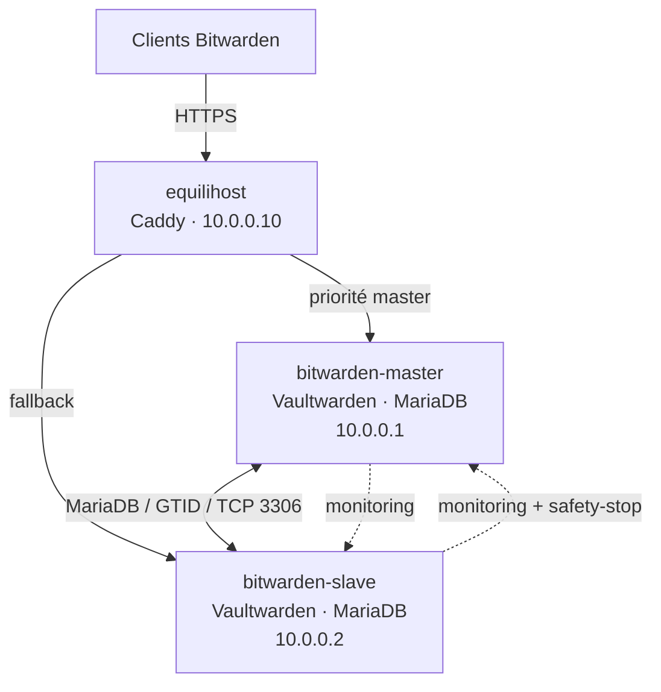
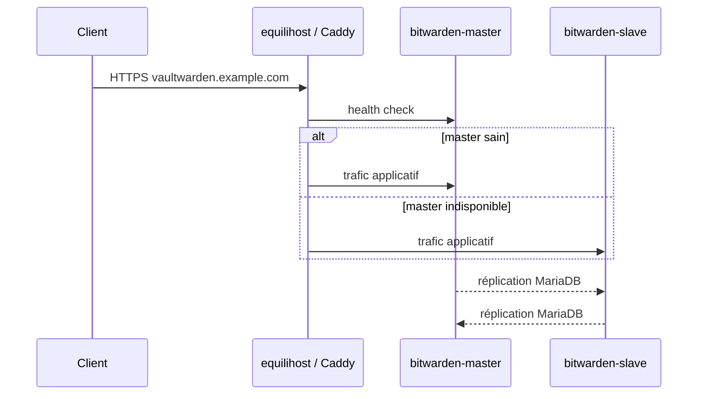

# Vaultwarden haute disponibilité — infrastructure, exploitation et reprise

[](https://github.com/dani-garcia/vaultwarden)
[](https://caddyserver.com/)
[](https://mariadb.org/)
[](https://www.docker.com/)
[](https://www.wireguard.com/)
[](https://www.gnu.org/software/bash/)
[](https://www.kernel.org/)
[](docs/01-architecture-et-conception.md)

Infrastructure Vaultwarden personnelle répartie sur **deux sites backend distincts**
et un VPS d'entrée. Le projet couvre la conception réseau, la réplication MariaDB
bidirectionnelle, le failover Caddy, la supervision, l'exploitation quotidienne, la
gestion d'incidents et la reconstruction manuelle des nœuds.

Le dépôt public conserve les noms internes (`bitwarden-master`, `bitwarden-slave`,
`equilihost`) et l'adressage WireGuard (`10.0.0.1`, `10.0.0.2`, `10.0.0.10`) afin de
rester directement exploitable. Le domaine réel, les IPv4/IPv6 publiques et tous les
secrets sont remplacés ou supprimés.

## TL;DR



- `equilihost` termine TLS et constitue le point d'entrée public.
- Caddy privilégie `bitwarden-master` et bascule vers `bitwarden-slave` si nécessaire.
- chaque backend exécute son propre Vaultwarden et sa propre MariaDB locale ;
- MariaDB réplique dans les deux sens avec des `server_id` et offsets d'auto-incrément distincts ;
- WireGuard transporte les flux inter-sites ;
- le monitoring contrôle la réplication, la cohérence et peut arrêter uniquement le Vaultwarden du slave en situation critique confirmée ;
- les fichiers `sends/` et `attachments/` restent locaux et ne sont pas couverts par la réplication SQL ;
- la stratégie de sauvegarde complète reste un axe d'amélioration prioritaire.

## Pourquoi cette architecture ?

Le principe de départ est de ne pas placer les deux copies du service dans le même
panier : les backends vivent sur deux machines, deux SSD, deux LAN, deux opérateurs et
deux lieux différents. Une panne locale ne doit donc pas faire disparaître à la fois
le service et sa seconde copie SQL.

La contrepartie est qu'une architecture multi-master est plus complexe qu'un simple
serveur unique. La documentation insiste donc autant sur **la cohérence** que sur la
simple disponibilité : lorsqu'il existe un doute sérieux sur l'état du slave, la
conception préfère parfois le retirer du service plutôt que continuer à accepter des
écritures potentiellement divergentes.

## Architecture

| Nœud | Adresse WireGuard | Rôle |
|---|---:|---|
| `bitwarden-master` | `10.0.0.1` | backend préféré, Vaultwarden, MariaDB, monitoring |
| `bitwarden-slave` | `10.0.0.2` | backend de secours, Vaultwarden, MariaDB, monitoring + safety-stop |
| `equilihost` | `10.0.0.10` | Caddy, terminaison TLS et health checks |



[Comprendre l'architecture en détail](docs/01-architecture-et-conception.md).

## Contenu du dépôt

```text
.
├── README.md
├── docs/
│   ├── 01-architecture-et-conception.md
│   ├── 02-mise-en-oeuvre-et-reconstruction.md
│   ├── 03-exploitation-et-maintenance.md
│   ├── 04-supervision-replication-et-coherence.md
│   ├── 05-incidents-et-pra.md
│   ├── 06-historique-decisions-et-rex.md
│   └── 07-axes-d-amelioration.md
├── configs/
│   ├── caddy/
│   ├── docker/
│   ├── mariadb/
│   ├── systemd/
│   └── wireguard/
├── scripts/
│   ├── monitoring/
│   ├── reconciliation/
│   └── update/
├── SECURITY.md
├── CONTRIBUTING.md
└── COPYRIGHT.md
```

Les configurations et scripts restent séparés de la documentation : les pages
expliquent **pourquoi et comment**, tandis que `configs/` et `scripts/` conservent les
artefacts techniques à relire ou déployer.

## Documentation

La documentation principale tient volontairement en sept guides :

1. [**Architecture et conception**](docs/01-architecture-et-conception.md) — topologie,
   flux, HA, MariaDB, stockage, Caddy, WireGuard, sécurité et limites.
2. [**Mise en œuvre et reconstruction**](docs/02-mise-en-oeuvre-et-reconstruction.md) —
   installation manuelle depuis un système vierge, configuration et validation.
3. [**Exploitation et maintenance**](docs/03-exploitation-et-maintenance.md) — contrôles
   quotidiens, mises à jour, maintenance, commandes d'exploitation et validations.
4. [**Supervision, réplication et cohérence**](docs/04-supervision-replication-et-coherence.md) —
   fonctionnement détaillé des scripts, timers, alertes et safety-stop.
5. [**Incidents et PRA**](docs/05-incidents-et-pra.md) — runbooks de panne, split-brain,
   perte de nœud, reconstruction et reprise.
6. [**Historique, décisions et REX**](docs/06-historique-decisions-et-rex.md) — chronologie,
   ADR regroupées et incidents ayant réellement influencé l'architecture.
7. [**Axes d'amélioration**](docs/07-axes-d-amelioration.md) — checklist priorisée de la
   dette technique et des évolutions à réaliser.

### Référence des artefacts techniques

- [Configurations publiées](configs/README.md)
- [Scripts d'exploitation et de monitoring](scripts/README.md)
- [Politique de sécurité du dépôt](SECURITY.md)
- [Contribution](CONTRIBUTING.md)
- [Droits d'auteur](COPYRIGHT.md)

## Exploitation — contrôle rapide

Sur un backend :

```bash
sudo wg show
sudo systemctl is-active mariadb docker
sudo docker ps --filter name=vaultwarden
sudo mariadb -e "SHOW SLAVE STATUS\\G" | grep -E \
  'Master_Host|Slave_IO_Running|Slave_SQL_Running|Seconds_Behind_Master|Last_IO_Errno|Last_SQL_Errno'
```

Sur le VPS :

```bash
sudo wg show
sudo systemctl is-active caddy
sudo caddy validate --config /etc/caddy/Caddyfile
```

Les commandes détaillées, résultats attendus et opérations de rollback sont dans le
[guide d'exploitation](docs/03-exploitation-et-maintenance.md).

## Configurations et scripts

Le dépôt conserve notamment :

- le bloc Caddy dédié à Vaultwarden ;
- le `docker-compose.yml` publié sans secrets ;
- les paramètres MariaDB propres au master et au slave ;
- les unités/timers systemd du monitoring ;
- les gabarits WireGuard avec clés et endpoints publics masqués ;
- le monitor de réplication ;
- le contrôle quotidien de cohérence ;
- le wrapper de réconciliation ;
- le script de réconciliation split-brain ;
- le script de mise à jour Vaultwarden.

> [!IMPORTANT]
> Un fichier publié dans `configs/` n'est pas automatiquement un « copier-coller
> aveugle ». Lire son en-tête et la documentation associée, notamment lorsqu'un
> secret ou un élément non fourni doit être injecté localement.

## Compétences illustrées

Ce dépôt peut aussi servir de vitrine technique. Le projet met concrètement en œuvre :

- **Linux / administration système** : systemd, permissions, services, journald,
  réseau et diagnostic de boot ;
- **Docker** : déploiement Vaultwarden, volumes persistants, lifecycle et inspection ;
- **MariaDB** : réplication bidirectionnelle, GTID, binlogs, offsets d'auto-incrément,
  diagnostic IO/SQL et gestion prudente du split-brain ;
- **WireGuard** : overlay privé inter-sites et routage point à point ;
- **Caddy** : terminaison TLS, reverse proxy, health checks et failover ;
- **Bash** : scripts de monitoring, état persistant, alertes, verrouillage et procédures ;
- **Haute disponibilité** : séparation géographique, dépendances, failover et analyse des limites ;
- **Gestion d'incidents** : reconstitution chronologique, cause racine, rollback,
  validation et REX ;
- **Sécurité** : réduction de surface d'exposition, gestion des secrets, permissions,
  firewall et attention aux données sensibles dans les logs ;
- **PRA / reconstruction** : procédures manuelles conçues pour reconstruire un nœud
  plutôt que dépendre d'une automatisation opaque.

L'intérêt du projet n'est pas d'affirmer que l'infrastructure est parfaite : il est de
montrer une architecture réellement exploitée, les compromis qui l'ont construite et
la capacité à la maintenir et à l'améliorer.

## Limites connues

Les limites et travaux restants ne sont pas répétés dans chaque page. Ils sont
centralisés dans [la checklist des axes d'amélioration](docs/07-axes-d-amelioration.md).
Les plus structurants concernent aujourd'hui la sauvegarde, les fichiers Vaultwarden
non répliqués, la protection électrique du slave, la gestion des secrets et certains
points de durcissement Caddy/monitoring.

## Confidentialité

Le dépôt est conçu pour être publiable :

- le domaine réel n'apparaît pas ;
- les IPv4 et IPv6 publiques sont remplacées par des placeholders ;
- aucune clé WireGuard privée n'est publiée ;
- aucun mot de passe, token, hash de mot de passe ou secret SMTP ne doit être commité ;
- `vaultwarden.example.com` est utilisé à la place du domaine réel ;
- les IP WireGuard internes sont volontairement conservées.

Avant chaque publication, rechercher au minimum les domaines, IP publiques, tokens,
clés privées, `DATABASE_URL`, `ADMIN_TOKEN` et fichiers `.env` réels.

## Licence et réutilisation

Le dépôt est destiné à être publiquement consultable. Les conditions exactes de
réutilisation restent décrites par `COPYRIGHT.md` tant qu'une licence définitive n'est
pas choisie. Ne pas interpréter la mise à disposition publique comme une autorisation
implicite de redistribution.
