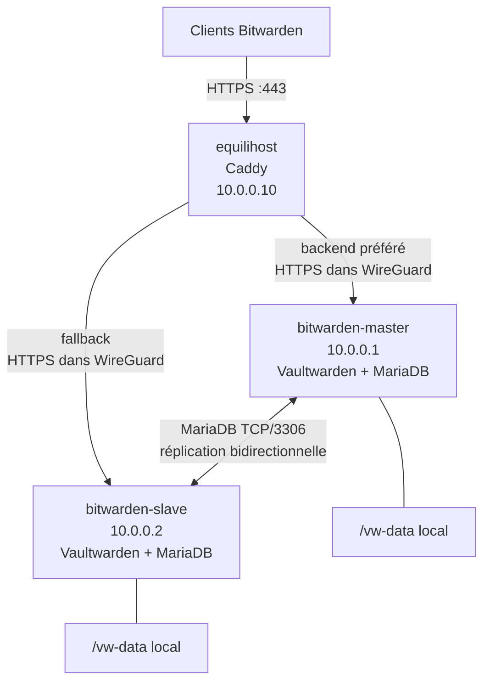
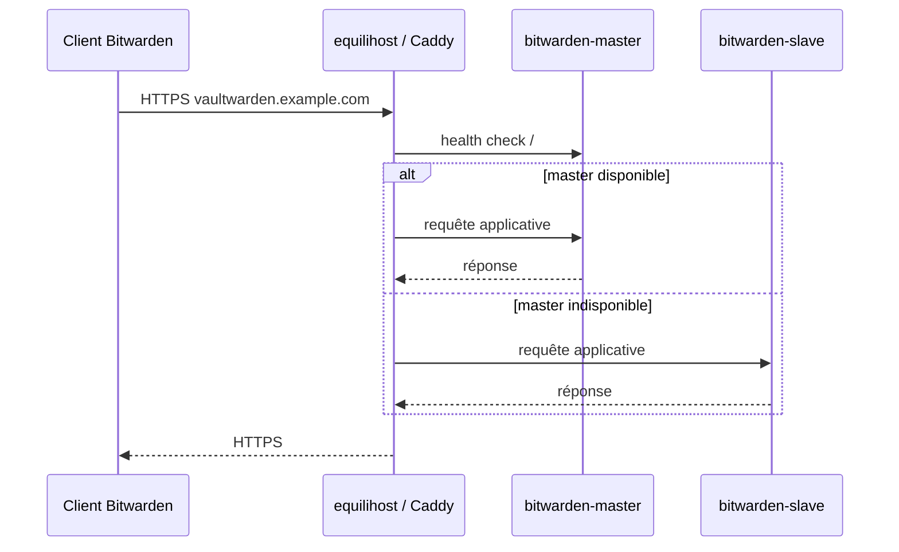
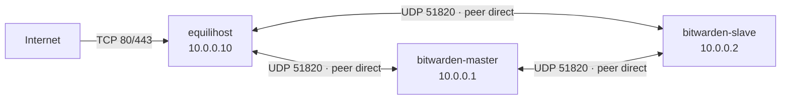
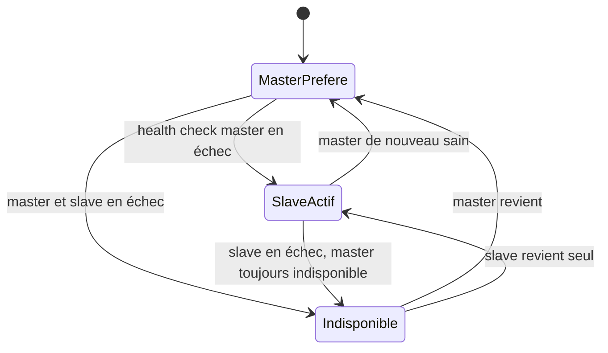
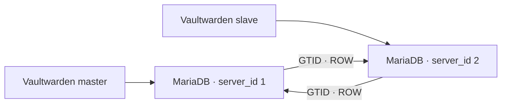
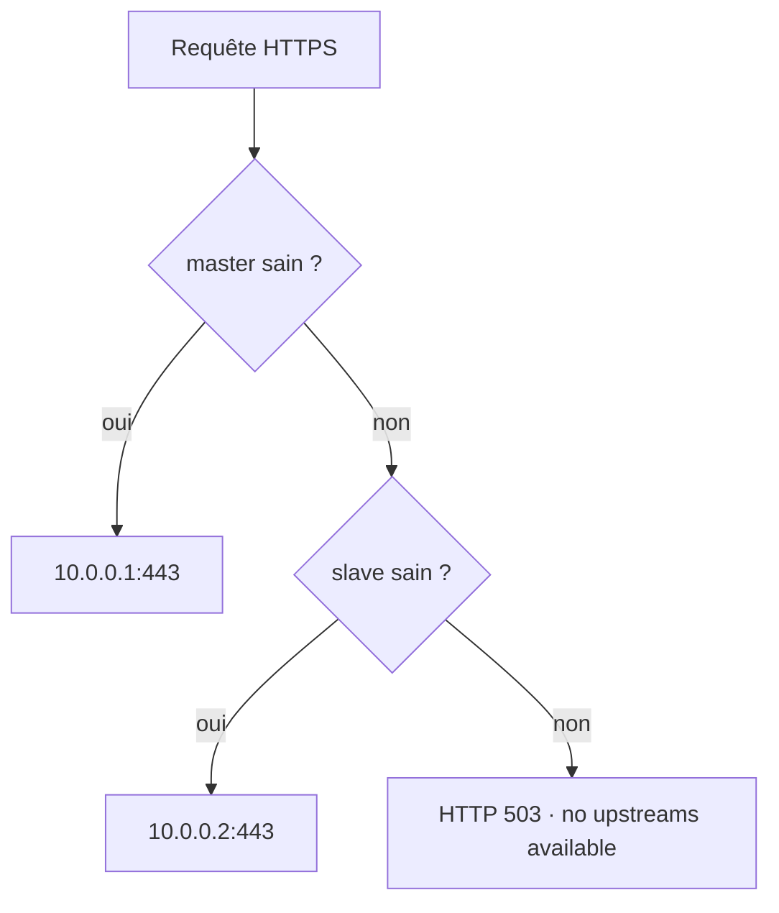
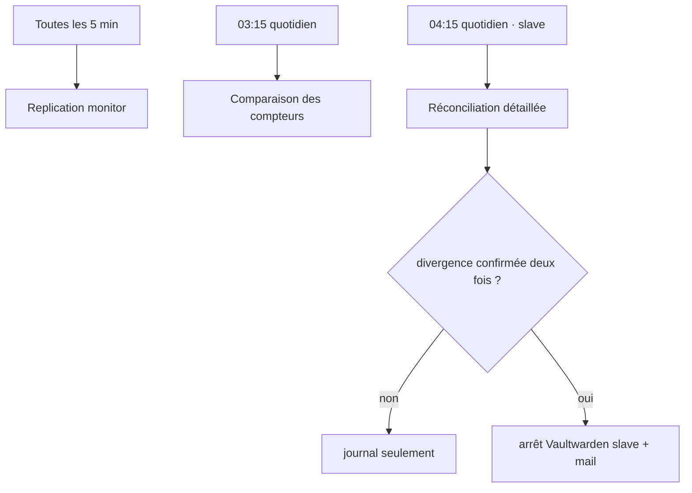
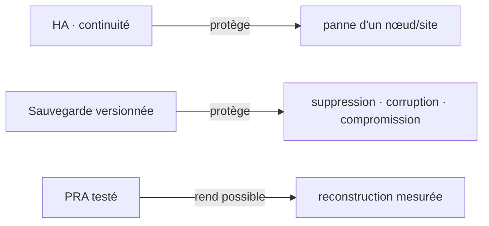

# Architecture et conception

[← README](../README.md) · [Mise en œuvre →](02-mise-en-oeuvre-et-reconstruction.md)

Cette page est la **référence d'architecture** du projet. Elle regroupe : réseau, flux,
haute disponibilité, MariaDB, stockage, Caddy, monitoring, sécurité et limites de
reprise.

La documentation décrit d'abord **l'infrastructure réellement exploitée**. Les
améliorations non encore déployées sont centralisées dans
[les axes d'amélioration](07-axes-d-amelioration.md).

## Vue d'ensemble

L'infrastructure repose sur trois nœuds Linux reliés par WireGuard :

| Nœud | WireGuard | Fonction principale | Position dans le service |
|---|---:|---|---|
| `bitwarden-master` | `10.0.0.1` | Vaultwarden + MariaDB + supervision | backend préféré |
| `bitwarden-slave` | `10.0.0.2` | Vaultwarden + MariaDB + supervision | backend de secours |
| `equilihost` | `10.0.0.10` | Caddy + terminaison TLS | unique point d'entrée public |

Les deux backends sont installés sur **deux machines, deux SSD, deux réseaux locaux,
deux accès Internet et deux sites physiques différents**. Cette séparation est le
premier mécanisme de résilience de l'architecture : la perte d'un site ou d'un disque
ne supprime pas automatiquement l'autre copie de la base et le second backend.



Le domaine publié dans ce dépôt est volontairement remplacé par
`vaultwarden.example.com`. Les IPv4/IPv6 publiques sont également masquées. Les
hostnames internes et les IP WireGuard sont conservés parce qu'ils constituent la
référence opérationnelle du projet.

## Chemin d'une requête

Une requête utilisateur ne rejoint jamais directement un backend depuis Internet.
Elle arrive sur `equilihost`, où Caddy termine TLS et sélectionne un upstream. La
politique `first` donne la priorité au master. Si le health check du master échoue,
Caddy peut envoyer les requêtes vers le slave.



Le failover HTTP est donc **master → slave**, pas du load-balancing actif/actif.
Caddy vérifie la disponibilité HTTP de chaque backend toutes les cinq secondes ; il
ne connaît pas directement l'état de la réplication MariaDB. Le monitoring local des
backends complète ce mécanisme, notamment avec la possibilité d'arrêter le
Vaultwarden du slave lorsqu'une divergence critique est suffisamment établie.

## Ce que la haute disponibilité couvre — et ce qu'elle ne couvre pas

| Scénario | Couverture actuelle | Explication |
|---|---|---|
| panne du master | bonne | Caddy peut servir le slave |
| panne du slave | bonne pour le service courant | le master reste prioritaire |
| panne d'un SSD backend | partielle | l'autre nœud conserve sa DB, mais les fichiers applicatifs locaux ne sont pas synchronisés |
| panne d'un site / opérateur backend | bonne si l'autre backend et le VPS restent accessibles | les sites et FAI sont indépendants |
| panne du VPS | non redondée | `equilihost` est le SPOF d'entrée publique |
| suppression logique / erreur SQL | faible | une réplication peut propager une mauvaise opération |
| perte d'un Send / attachment local | faible | les métadonnées SQL sont répliquées, pas les fichiers |
| perte simultanée des deux backends | non couverte | nécessite une vraie sauvegarde/restauration |

Cette distinction est essentielle : **réplication, haute disponibilité et sauvegarde
ne répondent pas au même problème**. La réplication améliore la continuité de service
et la redondance des données SQL ; une sauvegarde versionnée protège contre la perte
logique, la corruption propagée et les scénarios où les deux copies actives ne sont
plus exploitables.
## Infrastructure réseau

Le plan logique utilise WireGuard comme réseau d’administration et de transport applicatif. Les adresses publiques servent uniquement d’endpoints WireGuard et à l’accès au VPS ; elles sont volontairement absentes de ce dépôt.



La topologie WireGuard est un **full mesh à trois pairs** : chaque nœud connaît directement les deux autres. `equilihost` n’est donc pas un routeur obligatoire entre master et slave. La réplication MariaDB et les accès HTTPS internes utilisent les adresses `10.0.0.x`.

Règles structurantes :

- aucun backend Vaultwarden n’est publié volontairement sur Internet ;
- MariaDB doit être filtrée pour le réseau WireGuard, même si `bind-address=0.0.0.0` est actuellement observé ;
- l’ouverture UDP/51820 doit être présente sur chaque endpoint ;
- `PersistentKeepalive=25` est utilisé sur les pairs qui en ont besoin derrière NAT ; la configuration relevée du master n’en utilisait pas ;
- les fichiers WireGuard publics sont des gabarits, car les clés et endpoints réels n’ont pas été fournis.

Voir [l’installation WireGuard](02-mise-en-oeuvre-et-reconstruction.md) et [l’incident du tunnel](05-incidents-et-pra.md).


## Flux et ports

| Source | Destination | Port | Usage | Exposition attendue |
|---|---|---:|---|---|
| Internet | `equilihost` | TCP/80, TCP/443 | redirection HTTP et HTTPS | publique |
| peers WireGuard | chaque nœud | UDP/51820 | tunnel inter-sites | endpoints publics autorisés |
| `equilihost` | backends | TCP/443 | proxy et health checks Vaultwarden | WireGuard uniquement |
| master | slave | TCP/3306 | réplication et contrôles MariaDB | WireGuard uniquement |
| slave | master | TCP/3306 | réplication et contrôles MariaDB | WireGuard uniquement |
| administration | nœuds | TCP/SSH | exploitation | sources administratives seulement |

Le Caddyfile en production effectue un contrôle de santé toutes les cinq secondes sur `/`, avec un timeout de deux secondes. Cette fréquence détecte rapidement une panne mais produit beaucoup de logs lorsque le tunnel est cassé.

La matrice ne décrit aucun port LAN ou SSH public précis : ces valeurs n’étaient pas nécessaires à la publication et sont à conserver dans une documentation privée.


## Haute disponibilité

La couche applicative est active/active au sens où les deux Vaultwarden peuvent accepter des écritures. Caddy applique toutefois `lb_policy first` : le master est préféré et le slave n’est utilisé que lorsque le premier backend est déclaré indisponible.



Ce que l’architecture tolère : perte d’un backend, d’un disque de backend, d’un accès Internet domestique ou d’un site, tant que l’autre branche et le VPS restent sains.

Ce qu’elle ne tolère pas seule : perte de `equilihost`, suppression logique répliquée, corruption propagée, perte d’un fichier présent sur un seul `/vw-data`, ou panne simultanée des deux backends. Le 5 août 2026 a précisément combiné un master injoignable via WireGuard et un slave perturbé par deux coupures électriques.

La HA réduit le temps d’indisponibilité ; elle ne constitue ni une sauvegarde ni un PRA. Voir [Sauvegarde et PRA](01-architecture-et-conception.md).


## Réplication MariaDB

Les deux MariaDB 10.11 répliquent en mode bidirectionnel avec GTID. Le master possède `server_id=1` et le slave `server_id=2`. Les valeurs d’auto-incrément alternent pour réduire les collisions : incrément `2`, offset `2` sur le master et offset `1` sur le slave.

| Paramètre observé | Master | Slave |
|---|---:|---:|
| `server_id` | `1` | `2` |
| `log_bin` | `ON` | `ON` |
| `binlog_format` | `ROW` | `ROW` |
| `auto_increment_increment` | `2` | `2` |
| `auto_increment_offset` | `2` | `1` |
| `gtid_strict_mode` | `OFF` | `OFF` |
| `log_slave_updates` | `OFF` | `OFF` |
| rétention binlog | 10 jours | 10 jours |



Une réplication saine exige `Slave_IO_Running=Yes`, `Slave_SQL_Running=Yes`, aucune erreur SQL/IO et un retard nul ou maîtrisé sur les deux nœuds. Elle ne compare pas automatiquement l’intégralité des données : une réplication remise en route après divergence ne fusionne pas magiquement deux historiques.

Voir [la configuration de réplication](02-mise-en-oeuvre-et-reconstruction.md), [l’exploitation MariaDB](03-exploitation-et-maintenance.md) et [le runbook split-brain](05-incidents-et-pra.md).


## Stockage Vaultwarden

Chaque conteneur monte son propre `/vw-data` sur `/data`. La base métier active est MariaDB, mais le volume local contient encore des éléments importants : clés RSA, configuration éventuelle, cache d’icônes, `sends/`, `attachments/` et reliquats SQLite.

| Élément | Répliqué par MariaDB | Constat |
|---|---|---|
| utilisateurs, coffres, organisations | oui | données relationnelles |
| métadonnées des Sends | oui | ligne présente dans MariaDB |
| fichiers de Sends | non | fichier observé sur un seul nœud |
| pièces jointes | non | dossiers locaux indépendants |
| clés RSA | non par MariaDB | hashes observés identiques sur la production relevée |
| `config.json` | non | différent entre nœuds ; diagnostic Vaultwarden indiquait qu’il n’était pas utilisé à la date de contrôle |
| anciennes bases SQLite | non | reliquats historiques à archiver/supprimer après preuve |

Le risque principal est une réponse applicative cohérente avec une base répliquée alors que le fichier demandé n’existe pas sur le backend sélectionné. Une stratégie de synchronisation ou de stockage partagé doit être conçue sans recopier à l’aveugle les fichiers runtime.

Voir [l’incident fichier manquant](05-incidents-et-pra.md) et [l’axe d’amélioration correspondant](07-axes-d-amelioration.md).


## Reverse proxy Caddy

`equilihost` exécute Caddy comme service systemd. Le bloc Vaultwarden en production utilise le domaine public, applique des en-têtes de sécurité, préfère `10.0.0.1:443`, bascule vers `10.0.0.2:443` et vérifie les deux backends toutes les cinq secondes.



La production actuelle utilisait Caddy 2.6.2 fourni par Debian 12, `tls_insecure_skip_verify` pour les certificats backend auto-signés et `X-Real-IP`. Les points à corriger sont la mise à niveau de Caddy, la politique de journalisation des URLs contenant `access_token`, et le durcissement systemd.

Le fichier public est une copie nettoyée du bloc réel : [configs/caddy/Caddyfile](../configs/caddy/Caddyfile).


## Architecture du monitoring

Trois contrôles systemd structurent la surveillance :

1. toutes les cinq minutes, état de réplication local et distant, état du conteneur et alertes ;
2. chaque jour à 03:15, comparaison légère des compteurs de douze tables ;
3. sur le slave, réconciliation détaillée quotidienne à 04:15 avec double contrôle séparé de 300 secondes.



Le master ne doit jamais être arrêté automatiquement. Le slave arrêté par le monitor n’est jamais redémarré automatiquement. Ce choix fail-closed limite l’aggravation d’un split-brain mais peut réduire la disponibilité ; il est détaillé dans [la logique safety-stop](04-supervision-replication-et-coherence.md).


## Sécurité

La sécurité repose sur plusieurs couches : terminaison TLS publique sur Caddy, réseau privé WireGuard, TLS interne auto-signé, comptes MariaDB séparés, firewall hôte et principe de non-publication des backends.

En pratique, les trois nœuds n’appliquent pas exactement la même défense réseau : le master utilise UFW, le slave s’appuie encore principalement sur le filtrage de la Livebox/Orange, et le VPS repose surtout sur le firewall fournisseur tandis que son INPUT local reste permissif. Les flux applicatifs inter-sites passent néanmoins par WireGuard.

Les certificats backend sont auto-signés et distincts sur master/slave. Caddy chiffre bien les flux vers les backends, mais ne vérifie actuellement pas leur identité (`tls_insecure_skip_verify`). Ce choix est acceptable fonctionnellement dans le tunnel WireGuard, mais il doit rester explicite.

Les exemples publics utilisent des variables, des clés factices et des endpoints masqués. Les travaux de durcissement sont regroupés dans [SECURITY.md](../SECURITY.md) et [les axes d’amélioration](07-axes-d-amelioration.md).


## Sauvegarde et PRA

**État actuel : aucune sauvegarde périodique indépendante de Vaultwarden.** Les seuls dumps recensés étaient créés avant certaines mises à jour. Aucun Restic, Borg, rclone, rsync, duplicity, cron ou timer de sauvegarde applicative n’était actif sur les trois nœuds.

La redondance géographique protège d’une panne matérielle ou d’un site, mais reproduit aussi les suppressions et erreurs logiques. Elle ne protège pas les fichiers locaux absents de l’autre nœud.



La stratégie cible reste à concevoir et tester : sauvegarde chiffrée hors site de MariaDB, `/vw-data` utile, configs et clés ; rétention ; contrôle d’intégrité ; restauration régulière sur environnement isolé. Les pages PRA décrivent les séquences manuelles sans prétendre qu’un outil de sauvegarde est déjà installé.


## Inventaire technique

| Nœud | Plateforme observée | Site/réseau | Composants |
|---|---|---|---|
| `bitwarden-master` | Ubuntu 24.04 LTS, ARM64, SSD | site principal, accès Freebox | Vaultwarden Docker, MariaDB 10.11, WireGuard, monitoring |
| `bitwarden-slave` | Raspberry Pi, ARM64, SSD, OS Debian/Raspberry Pi | second site, accès Orange | Vaultwarden Docker, MariaDB 10.11, WireGuard, monitoring + safety-stop |
| `equilihost` | VPS Lite, Debian 12, environ 2 Gio de RAM sur la production relevée | hébergeur externe | Caddy, WireGuard, terminaison TLS et routage |

Les relevés d’août 2026 montrent Vaultwarden 1.37.1 sur les deux backends. Le master utilisait MariaDB 10.11.14 et le slave 10.11.18 au moment des relevés. Caddy était en 2.6.2.

Ces versions sont historiques, pas des contraintes de reconstruction. Une mise à jour doit rester séquencée et testée.

### Chemins principaux

| Chemin | Usage |
|---|---|
| `/opt/vaultwarden` | compose Vaultwarden |
| `/vw-data` | volume local monté dans `/data` |
| `/ssl/keys` | certificat et clé backend |
| `/opt/update_vaultwarden` | script et backups de mise à jour |
| `/usr/local/lib/vaultwarden-monitor` | scripts du monitoring |
| `/etc/vaultwarden-monitor` | environnement privé et maintenance |
| `/var/lib/vaultwarden-monitor` | états d’incident |
| `/etc/caddy/Caddyfile` | reverse proxy sur `equilihost` |
| `/etc/wireguard/wg0.conf` | tunnel de chaque nœud |


## Adressage et anonymisation

### Adresses publiables

| Nom | WireGuard | Fonction |
|---|---:|---|
| `bitwarden-master` | `10.0.0.1/32` | backend préféré |
| `bitwarden-slave` | `10.0.0.2/32` | backend de secours |
| `equilihost` | `10.0.0.10/32` | point d’entrée et routeur |

### Valeurs volontairement masquées

- IPv4 et IPv6 publiques des trois sites ;
- ports SSH personnalisés ;
- adresses LAN domestiques utilisées localement par MariaDB dans le compose en production ;
- domaine réel.

Les gabarits emploient :

```text
vaultwarden.example.com
<IPV4_PUBLIQUE_...>
<IPV6_PUBLIQUE_...>
<CLE_PUBLIQUE_WIREGUARD_...>
<CLE_PRIVEE_WIREGUARD_...>
```

Le réseau `10.0.0.0/24` n’est pas un placeholder : il correspond au plan WireGuard validé pour la documentation et l’exploitation.


## Référence rapide des ports

| Port | Protocole | Écoute | Sources autorisées | Contrôle |
|---:|---|---|---|---|
| 80 | TCP | `equilihost` | Internet | redirection ACME/HTTPS |
| 443 | TCP/UDP | `equilihost` | Internet | Caddy |
| 443 | TCP | master/slave | `10.0.0.10` | Vaultwarden/TLS backend |
| 3306 | TCP | master/slave | `10.0.0.1` et `10.0.0.2`, comptes nécessaires | MariaDB |
| 51820 | UDP | trois nœuds | endpoints peers privés | WireGuard |
| SSH | TCP | trois nœuds | sources d’administration | port privé non publié |

### Tests rapides

```bash
# Depuis equilihost
nc -vz -w 3 10.0.0.1 443
nc -vz -w 3 10.0.0.2 443

# Depuis chaque backend
nc -vz -w 3 10.0.0.10 443
nc -vz -w 3 10.0.0.2 3306
```

Adapter la dernière adresse selon le nœud. Un port ouvert n’établit pas à lui seul l’autorisation correcte : contrôler aussi l’origine des connexions MariaDB et les règles firewall.


## Variables de configuration

### Vaultwarden

| Variable | Valeur publique/exemple | Secret |
|---|---|---|
| `VAULTWARDEN_VERSION` | `1.37.1` dans les relevés d’août 2026 | non |
| `DATABASE_URL` | URL MariaDB locale | oui |
| `ADMIN_TOKEN` | aucune valeur versionnée | oui |
| `DOMAIN` | `https://vaultwarden.example.com` | non |
| `ROCKET_TLS` | chemins `/ssl/certs.pem` et `/ssl/key.pem` | non, mais clés privées séparées |

### Monitoring

| Variable | Master | Slave |
|---|---|---|
| `NODE_ROLE` | `master` | `slave` |
| `LOCAL_DB_HOST` | `10.0.0.1` | `10.0.0.2` |
| `PEER_HOST` | `10.0.0.2` | `10.0.0.1` |
| `LOCAL_SERVER_ID` | `1` | `2` |
| `PEER_SERVER_ID` | `2` | `1` |
| `ALLOW_SAFETY_STOP` | `0` | `1` |
| `LAG_WARNING_SECONDS` | `60` | `60` |
| `LAG_CRITICAL_SECONDS` | `300` | `300` |
| `FAILURES_BEFORE_STOP` | `2` | `2` |

`MONITOR_PASSWORD`, les variables SMTP et les comptes d’écriture du reconcile restent secrets. Voir [l’exemple d’environnement](../configs/monitoring/.env.example).

## Principes de conception à retenir

1. **Le master est préféré, mais le slave est réellement inscriptible.** Les deux
   Vaultwarden utilisent leur base MariaDB locale ; la réplication doit donc rester
   cohérente dans les deux sens.
2. **Le safety-stop est asymétrique.** Le master n'est jamais arrêté automatiquement
   par le monitor. Le slave peut l'être pour préférer l'indisponibilité à la création
   d'une nouvelle divergence dans une situation ambiguë.
3. **WireGuard est la couche de transport inter-sites.** Les IP `10.0.0.x` sont les
   adresses de référence pour Caddy, MariaDB et les contrôles croisés.
4. **Les fichiers Vaultwarden ne suivent pas MariaDB.** `attachments/` et `sends/`
   restent des données locales à traiter séparément dans la stratégie de sauvegarde.
5. **Le VPS reste central.** Deux backends ne signifient pas que chaque couche est
   redondée ; l'entrée publique est actuellement unique.

## Navigation

[← README](../README.md) · [Mise en œuvre et reconstruction →](02-mise-en-oeuvre-et-reconstruction.md)
