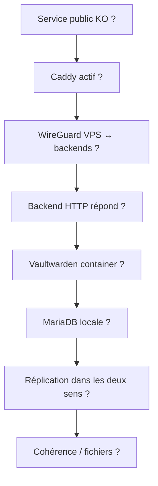

# Exploitation et maintenance

[← Mise en œuvre](02-mise-en-oeuvre-et-reconstruction.md) · [README](../README.md) · [Supervision →](04-supervision-replication-et-coherence.md)

Cette page constitue le **runbook quotidien**. Elle regroupe le contrôle d'état,
Vaultwarden, MariaDB, WireGuard, Caddy, maintenance, mise à jour et les opérations de
sauvegarde/restauration. L'idée est de garder les gestes d'exploitation au même
endroit plutôt que de naviguer entre une dizaine de pages courtes.

## Contrôle rapide en cinq minutes

Sur chaque backend :

```bash
hostname
systemctl --failed --no-pager
sudo wg show
sudo systemctl is-active mariadb docker
sudo docker ps --filter name=vaultwarden
sudo mariadb -e "SHOW SLAVE STATUS\\G" | grep -E \
  'Master_Host|Slave_IO_Running|Slave_SQL_Running|Seconds_Behind_Master|Last_IO_Errno|Last_SQL_Errno'
```

Sur `equilihost` :

```bash
sudo wg show
sudo systemctl is-active caddy
sudo caddy validate --config /etc/caddy/Caddyfile
curl -kfsS --connect-timeout 3 https://10.0.0.1:443/ >/dev/null && echo master-ok
curl -kfsS --connect-timeout 3 https://10.0.0.2:443/ >/dev/null && echo slave-ok
```

Pour les logs Caddy, éviter de copier des journaux HTTP bruts : certaines erreurs de
reverse proxy peuvent contenir la query string d'une requête WebSocket Vaultwarden,
et donc un `access_token`. Préférer des filtres ciblés sur le logger de health check
ou supprimer les paramètres sensibles avant partage.

## Ordre de diagnostic recommandé



Le principe est de partir de l'extérieur vers l'intérieur sans modifier l'état tant
que la cause n'est pas identifiée.
## Contrôle de l’état de l’infrastructure

### Objectif

Obtenir en moins de dix minutes un état fiable du réseau, des bases, des conteneurs, de Caddy et des timers.

### Prérequis

- accès SSH aux trois nœuds
- aucune commande de modification pendant le diagnostic
- connaissance d’une éventuelle maintenance planifiée

### Commandes

```bash
hostname
systemctl --failed --no-pager
sudo wg show
sudo systemctl is-active mariadb docker
sudo docker inspect vaultwarden \
  --format 'Status={{.State.Status}} Health={{if .State.Health}}{{.State.Health.Status}}{{else}}none{{end}}'
sudo mariadb -e "SHOW SLAVE STATUS\G" | grep -E \
  'Master_Host|Slave_IO_Running|Slave_SQL_Running|Seconds_Behind_Master|Last_.*Error'
systemctl list-timers --all --no-pager | grep vaultwarden
```

### Vérifications

- handshakes WireGuard récents
- deux threads de réplication à Yes sur chaque backend
- conteneurs running/healthy
- aucune unité critique en échec
- sur equilihost, Caddy actif et deux upstreams joignables

### Rollback

Aucune modification n’est prévue. Si une anomalie apparaît, arrêter le diagnostic général et suivre le runbook d’incident correspondant.

### Validation finale

- [ ] Trois nœuds contrôlés
- [ ] Réplication contrôlée dans les deux sens
- [ ] Conteneurs et Caddy contrôlés
- [ ] Timers contrôlés
- [ ] Anomalies orientées vers un runbook


## Exploitation de Vaultwarden

### Objectif

Consulter, arrêter ou redémarrer un backend sans confondre état Docker et état du service global.

### Prérequis

- vérifier quel backend sert actuellement le trafic
- activer le mode maintenance pour une action planifiée
- ne jamais arrêter les deux conteneurs simultanément

### Commandes

```bash
cd /opt/vaultwarden
sudo docker-compose ps
sudo docker logs --since 30m vaultwarden
sudo docker-compose stop vaultwarden
sudo docker-compose up -d vaultwarden
sudo docker inspect vaultwarden \
  --format '{{.State.Status}} {{if .State.Health}}{{.State.Health.Status}}{{end}}'
```

### Vérifications

- le backend restant répond via Caddy avant l’arrêt
- le conteneur redémarré atteint healthy
- le domaine runtime vaut vaultwarden.example.com
- aucune erreur de migration ou de base dans les logs

### Rollback

Si le conteneur ne devient pas sain, le laisser arrêté, remettre l’image/configuration précédente et conserver les logs. Ne pas forcer Caddy à l’utiliser.

### Validation finale

- [ ] Un seul backend modifié à la fois
- [ ] Healthcheck sain
- [ ] Caddy voit le backend UP
- [ ] Connexion client de test validée
- [ ] Mode maintenance retiré


## Mise à jour de Vaultwarden

### Objectif

Mettre à jour Vaultwarden nœud par nœud avec sauvegarde préalable, contrôle de santé et possibilité de retour arrière.

### Prérequis

- version cible validée hors production
- réplication saine avant l’opération
- espace disque suffisant pour le dump
- script importé relu et fichier .env privé correct
- commencer par le slave

### Commandes

```bash
sudo touch /etc/vaultwarden-monitor/maintenance
cd /opt/update_vaultwarden
sudo ./update_vaultwarden.sh <VERSION_CIBLE>
sudo docker inspect vaultwarden \
  --format 'Image={{.Config.Image}} Status={{.State.Status}} Health={{if .State.Health}}{{.State.Health.Status}}{{end}}'
sudo mariadb -e "SHOW SLAVE STATUS\G" | grep -E \
  'Slave_IO_Running|Slave_SQL_Running|Seconds_Behind_Master|Last_.*Error'
```

### Vérifications

- dump pré-mise à jour présent et non vide
- image cible réellement déployée
- healthcheck healthy
- aucune erreur de migration dans les logs
- réplication saine avant de passer au master

### Rollback

Le script possède un rollback d’image et de base. Si son rollback est déclenché, ne pas relancer à l’aveugle : conserver le dump et le journal, remettre l’ancien compose, puis analyser. La présence d’un dump n’autorise pas à écraser l’autre nœud.

### Validation finale

- [ ] Slave mis à jour et validé
- [ ] Master mis à jour et validé
- [ ] Deux sens de réplication sains
- [ ] Réconciliation sans application à zéro différence
- [ ] Fichier maintenance retiré


## Exploitation de MariaDB

### Objectif

Contrôler MariaDB et la réplication sans effectuer de correction automatique risquée.

### Prérequis

- exécuter les contrôles sur les deux nœuds
- ne pas utiliser le compte applicatif pour l’administration
- mettre Vaultwarden en maintenance avant une action de réplication

### Commandes

```bash
sudo systemctl status mariadb --no-pager
sudo mariadb -e "SHOW SLAVE STATUS\G"
sudo mariadb -e "SHOW MASTER STATUS\G"
sudo mariadb -NBe "SELECT @@server_id, @@gtid_slave_pos, @@gtid_binlog_pos, @@gtid_current_pos;"
sudo mariadb -NBe "SHOW PROCESSLIST;"
```

### Vérifications

- IO et SQL à Yes
- retard nul ou expliqué
- Last_IO_Errno et Last_SQL_Errno à 0
- Master_Host opposé correct
- aucune connexion MariaDB depuis une origine publique

### Rollback

Une consultation n’a pas de rollback. Après une mauvaise commande, arrêter les écritures sur les deux backends, prendre des dumps et suivre le runbook de divergence ; ne pas sauter un événement.

### Validation finale

- [ ] État des deux nœuds collecté
- [ ] GTID consigné
- [ ] Erreurs vérifiées
- [ ] Origines des connexions vérifiées
- [ ] Aucune correction non documentée


## Exploitation de WireGuard

### Objectif

Vérifier les tunnels et redémarrer proprement une interface sans perdre l’accès distant.

### Prérequis

- console de secours disponible pour equilihost
- copie privée du fichier wg0.conf
- ne pas exposer les sorties contenant des clés ou endpoints réels

### Commandes

```bash
sudo wg show
ip -brief address show wg0
systemctl is-enabled wg-quick@wg0
systemctl status wg-quick@wg0 --no-pager
ping -c 3 10.0.0.10
sudo systemctl restart wg-quick@wg0
```

### Vérifications

- adresse WireGuard attendue
- handshake récent avec chaque peer
- compteurs de transfert progressent
- TCP/443 et TCP/3306 joignables selon la matrice

### Rollback

Si le restart coupe le tunnel, utiliser la console, restaurer wg0.conf, supprimer seulement l’interface incohérente avec `sudo wg-quick down wg0`, puis démarrer le service. Ne pas supprimer les clés.

### Validation finale

- [ ] Service enabled
- [ ] Interface unique
- [ ] Peers attendus présents
- [ ] Flux applicatifs validés
- [ ] Caddy voit les backends


## Exploitation de Caddy

### Objectif

Valider et recharger Caddy sans interrompre inutilement le point d’entrée public.

### Prérequis

- copie sauvegardée du Caddyfile actif
- backends testés directement via WireGuard
- attention aux URLs de logs contenant access_token

### Commandes

```bash
sudo caddy fmt --diff /etc/caddy/Caddyfile
sudo caddy validate --config /etc/caddy/Caddyfile
sudo systemctl reload caddy
systemctl status caddy --no-pager
sudo journalctl -u caddy --since -15min --no-pager | \
  sed -E 's/(access_token=)[^&" ]+/\1<REDACTED>/g'
curl -I https://vaultwarden.example.com/
```

### Vérifications

- validation Caddy réussie avant reload
- certificat public valide
- absence de no upstreams available en régime normal
- transitions UP/DOWN cohérentes avec l’état réel

### Rollback

Restaurer le Caddyfile précédent, le valider puis recharger. Si Caddy ne démarre pas, conserver une copie de la configuration fautive pour analyse.

### Validation finale

- [ ] Configuration validée
- [ ] Reload sans interruption
- [ ] Master préféré
- [ ] Bascule slave testée
- [ ] Logs contrôlés sans divulgation


## Exploitation du monitoring

### Objectif

Consulter, mettre en maintenance et tester la supervision sans déclencher une action de sécurité inattendue.

### Prérequis

- scripts et common.sh complets sur le nœud
- connaître la différence entre --force-alert et --send-test-mail
- vérifier le rôle master/slave avant tout test

### Commandes

```bash
sudo test -e /etc/vaultwarden-monitor/maintenance \
  && echo "Maintenance active" || echo "Monitoring actif"
systemctl list-timers --all --no-pager | grep vaultwarden
sudo journalctl -u vaultwarden-replication-monitor.service -n 100 --no-pager
sudo touch /etc/vaultwarden-monitor/maintenance
sudo /usr/local/lib/vaultwarden-monitor/vaultwarden-replication-monitor.sh --send-test-mail
sudo rm -f /etc/vaultwarden-monitor/maintenance
```

### Vérifications

- en maintenance, les contrôles opérationnels sont ignorés
- le mail de test peut être envoyé explicitement
- le master n’autorise pas le safety-stop
- le timer de réconciliation détaillée reste actif seulement sur le slave

### Rollback

En cas de comportement douteux, laisser le fichier maintenance présent et désactiver les timers. Réactiver un par un après correction.

### Validation finale

- [ ] État maintenance connu
- [ ] Timers inventoriés
- [ ] Mail de test reçu
- [ ] Rôle/safety-stop vérifié
- [ ] Maintenance retirée après validation


## Maintenance planifiée

### Objectif

Mettre à jour ou redémarrer un nœud sans perdre la disponibilité ni provoquer de faux incident.

### Prérequis

- réplication saine
- backend opposé sain et visible par Caddy
- fenêtre annoncée
- console disponible en cas de reboot

### Commandes

```bash
sudo touch /etc/vaultwarden-monitor/maintenance
sudo mariadb -e "SHOW SLAVE STATUS\G" | grep -E \
  'Slave_IO_Running|Slave_SQL_Running|Seconds_Behind_Master'
sudo docker stop vaultwarden
sudo apt update
sudo apt upgrade
sudo reboot
```

### Vérifications

- attendre le retour WireGuard, MariaDB et Docker
- redémarrer Vaultwarden seulement après MariaDB
- vérifier Caddy avant de retirer la maintenance
- répéter sur l’autre nœud seulement après validation complète

### Rollback

Si le nœud ne revient pas, garder l’autre backend en service et suivre son runbook d’indisponibilité. Ne pas démarrer une maintenance simultanée.

### Validation finale

- [ ] Backend opposé sain
- [ ] Maintenance active
- [ ] Nœud revenu au boot
- [ ] Réplication rattrapée
- [ ] Vaultwarden sain
- [ ] Maintenance retirée


## Sauvegarde

### Objectif

Décrire l’état actuel et encadrer une sauvegarde manuelle tant que la stratégie automatisée n’est pas mise en œuvre.

### Prérequis

- 🟠 aucune chaîne de sauvegarde périodique n’est déployée
- destination chiffrée hors des trois nœuds
- espace suffisant
- secrets et clés traités séparément

### Commandes

```bash
sudo mariadb-dump --single-transaction --routines --events --triggers \
  vaultwarden | gzip > /tmp/vaultwarden-$(date +%F-%H%M).sql.gz
sudo tar --exclude='db.sqlite3*' -czf \
  /tmp/vw-data-$(date +%F-%H%M).tar.gz /vw-data
sha256sum /tmp/vaultwarden-*.sql.gz /tmp/vw-data-*.tar.gz
```

### Vérifications

- archives non vides
- sommes stockées avec la sauvegarde
- copie transférée hors site
- aucun secret laissé durablement dans /tmp
- rétention décidée explicitement

### Rollback

Supprimer de façon sûre les archives temporaires seulement après confirmation de la copie externe. Une sauvegarde sans test de restauration n’est pas considérée validée.

### Validation finale

- [ ] Dump cohérent créé
- [ ] Fichiers utiles inclus
- [ ] Copie externe chiffrée
- [ ] Sommes vérifiées
- [ ] Test de restauration planifié


## Restauration

### Objectif

Restaurer une copie dans un environnement isolé, puis décider explicitement si elle doit devenir la nouvelle référence de production.

### Prérequis

- sauvegarde et somme vérifiées
- environnement de test sans connexion de réplication à la production
- version MariaDB/Vaultwarden compatible
- validation humaine de la date de restauration

### Commandes

```bash
sha256sum -c SHA256SUMS
sudo mariadb -e "CREATE DATABASE vaultwarden_restore;"
gunzip -c vaultwarden-AAAA-MM-JJ-HHMM.sql.gz | \
  mariadb vaultwarden_restore
mariadb vaultwarden_restore -e "SHOW TABLES;"
tar -tzf vw-data-AAAA-MM-JJ-HHMM.tar.gz | head
```

### Vérifications

- import sans erreur
- tables et volumes présents
- Vaultwarden de test démarre sans écrire en production
- échantillon fonctionnel validé
- date et perte de données potentielle acceptées

### Rollback

Supprimer uniquement l’environnement de restauration isolé. Si une restauration en production a commencé, maintenir les clients hors ligne et réimporter le dump pré-intervention plutôt que mélanger les historiques.

### Validation finale

- [ ] Intégrité vérifiée
- [ ] Restauration isolée réussie
- [ ] Test applicatif réussi
- [ ] Décision de promotion documentée
- [ ] RPO/RTO mesurés

## Checklist après toute intervention

- [ ] WireGuard présente des handshakes récents vers les pairs attendus.
- [ ] MariaDB est active et les deux threads de réplication sont `Yes` sur les deux backends.
- [ ] `Seconds_Behind_Master` est revenu à une valeur déterminable et raisonnable.
- [ ] le conteneur Vaultwarden est `running` ; son endpoint local répond.
- [ ] Caddy voit les upstreams attendus et le domaine public répond.
- [ ] les timers de monitoring sont actifs.
- [ ] aucune maintenance flag oubliée n'empêche les contrôles normaux.
- [ ] les logs ne montrent pas de nouvelle erreur IO/SQL ou de restart inattendu.
- [ ] si des données ont été restaurées, vérifier aussi `sends/` et `attachments/`.

## Navigation

[← Mise en œuvre](02-mise-en-oeuvre-et-reconstruction.md) · [Supervision et cohérence →](04-supervision-replication-et-coherence.md)
