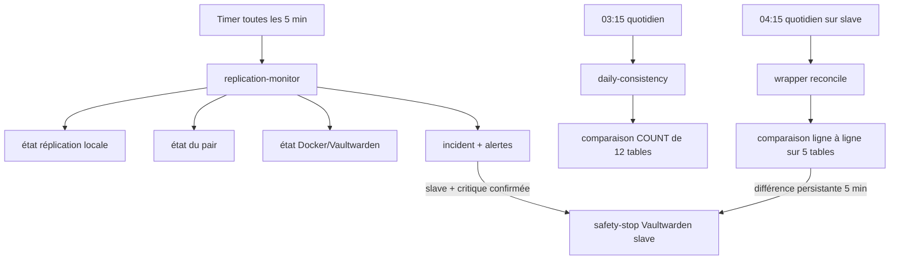
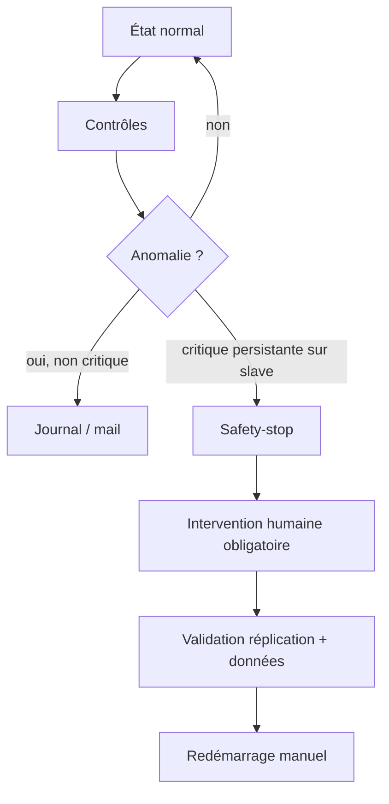
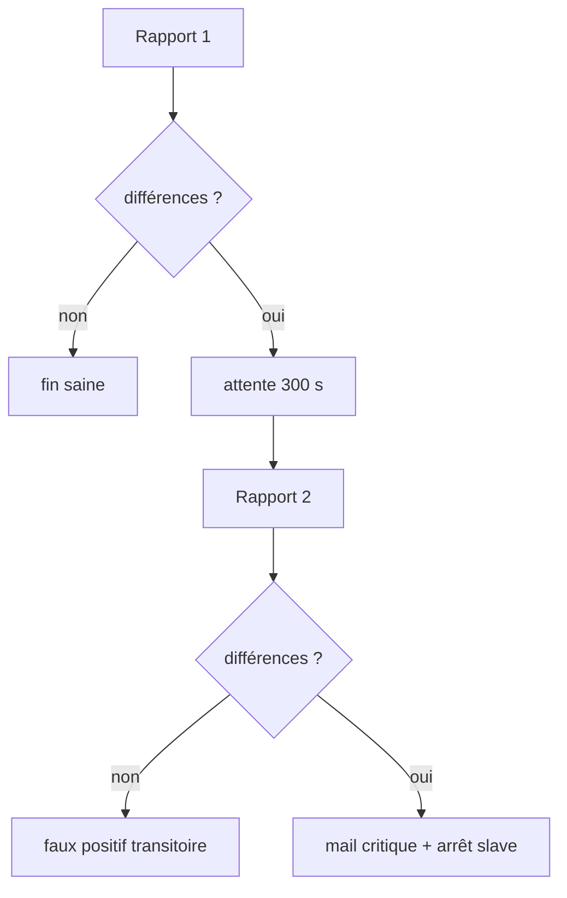
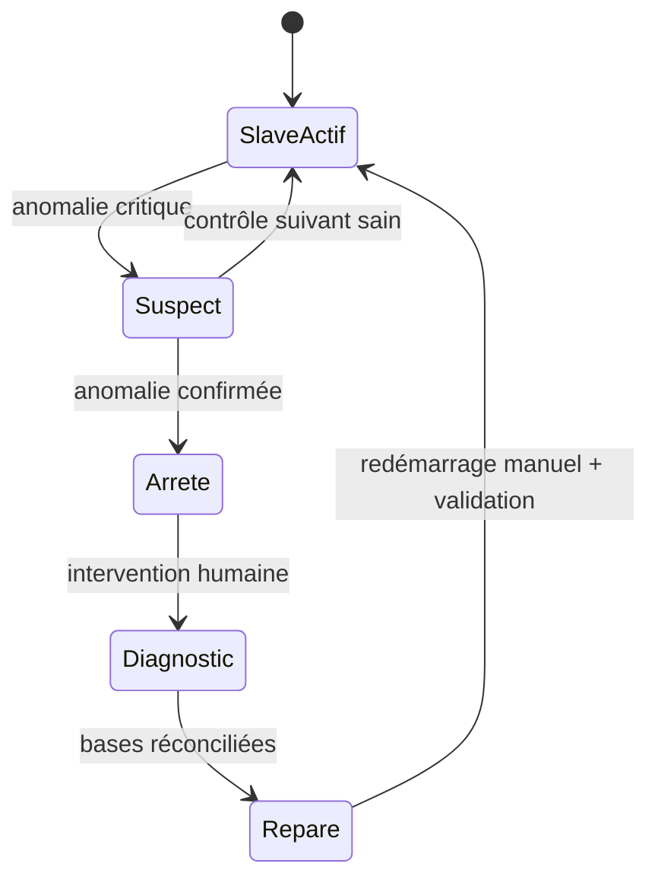

# Supervision, réplication et cohérence

[← Exploitation](03-exploitation-et-maintenance.md) · [README](../README.md) · [Incidents / PRA →](05-incidents-et-pra.md)

La supervision est une partie structurante du projet parce que les deux backends sont
inscriptibles. Elle ne sert pas seulement à envoyer des mails : elle participe à la
prévention du split-brain en privilégiant, sur le slave, la cohérence des données à
la disponibilité lorsque certaines conditions critiques sont confirmées.



## Les trois niveaux de contrôle

| Niveau | Fréquence | Ce qu'il vérifie | Limite principale |
|---|---|---|---|
| réplication | ~5 min | IO/SQL, lag, source, GTID, conteneur | ne compare pas le contenu applicatif complet |
| cohérence légère | quotidien | nombre de lignes de 12 tables | même nombre ≠ mêmes données |
| réconciliation dry-run | quotidien sur slave | comparaison détaillée de 5 tables cœur | couverture volontairement limitée |

Aucun de ces contrôles ne compare aujourd'hui le contenu réel de `sends/` et
`attachments/` entre les deux systèmes de fichiers.
## Monitoring — vue d’ensemble

La supervision a été construite après un incident de split-brain resté invisible environ deux semaines. Elle vise d’abord à détecter, alerter et limiter l’aggravation ; elle ne cherche pas à réparer automatiquement un conflit de données.

| Contrôle | Fréquence actuelle | Nœuds | Action possible |
|---|---|---|---|
| réplication + conteneur | toutes les 5 min | master et slave | mail ; arrêt du slave après seuil |
| compteurs de tables | 03:15 chaque jour | master et slave | mail |
| réconciliation détaillée | 04:15 chaque jour | slave uniquement | double contrôle ; arrêt du slave |



Les timers et scripts ont été comparés entre les deux nœuds. `common.sh` avait le même SHA-256 sur master et slave, mais son contenu n’a pas été fourni dans le corpus de cette V2. Les scripts versionnés restent donc des sources de référence incomplètes, pas un bundle installable.

Voir [les fichiers importés](../scripts/README.md) et [la provenance](01-architecture-et-conception.md).


## Monitoring — replication monitor

Le script `vaultwarden-replication-monitor.sh` s’exécute toutes les cinq minutes sur les deux backends. Les variables diffèrent par rôle :

| Variable | Master | Slave |
|---|---|---|
| `LOCAL_SERVER_ID` | 1 | 2 |
| `EXPECTED_MASTER_HOST` | 10.0.0.2 | 10.0.0.1 |
| `EXPECTED_GTID_MODE` | `Slave_Pos` | `Slave_Pos` |
| `LAG_WARNING_SECONDS` | 60 | 60 |
| `LAG_CRITICAL_SECONDS` | 300 | 300 |
| `FAILURES_BEFORE_STOP` | 2 | 2 |
| `ALLOW_SAFETY_STOP` | 0 | 1 |

Le contrôle valide la disponibilité SQL, la présence de `SHOW SLAVE STATUS`, l’hôte/port du pair, l’identifiant du serveur distant, les deux threads, le mode GTID, le retard et les erreurs. Il vérifie aussi le conteneur : absent, arrêté, en redémarrage, unhealthy, starting trop longtemps (seuil observé : 120 s) ou redémarrages répétés.

Les incidents sont mémorisés pour éviter un mail toutes les cinq minutes. Un rappel est possible à partir de l’heure configurée ; un mail de rétablissement contient une durée approximative. Le fichier `vaultwarden_stopped_by_monitor` est créé lors d’un arrêt mais aucun consommateur n’a été trouvé sur la production relevée : c’est un reliquat à nettoyer ou à exploiter explicitement.

Source : [script importé](../scripts/monitoring/vaultwarden-replication-monitor.sh).


## Monitoring — daily consistency

Le contrôle quotidien compare les nombres de lignes des mêmes douze tables sur les deux bases :

```text
users ciphers folders folders_ciphers devices twofactor
organizations users_organizations collections users_collections
attachments sends
```

Il ne lit ni le contenu des lignes ni les fichiers de `/vw-data`. Des compteurs égaux ne prouvent donc pas l’identité des bases ; des compteurs différents signalent en revanche une anomalie utile.

Le script interroge les bases séquentiellement. Une écriture légitime entre les deux requêtes peut produire une différence transitoire et deux nœuds peuvent envoyer des alertes proches. La réconciliation détaillée avec confirmation réduit ce risque pour le safety-stop.

Planification actuelle : `03:15 Europe/Paris` avec un délai aléatoire maximal de dix minutes, timer persistant sur les deux nœuds.

Source : [script importé](../scripts/monitoring/vaultwarden-daily-consistency.sh).


## Monitoring — reconcile

Le mécanisme détaillé comporte deux fichiers :

- `reconcile_split_brain.sh` : lit les deux bases, importe des dumps dans des bases temporaires locales, compare les lignes et génère `report.txt` ainsi que des propositions `apply_to_master.sql` et `apply_to_slave.sql` ;
- `vaultwarden-weekly-reconcile.sh` : wrapper systemd. Malgré son nom historique, la version active sur le slave est planifiée chaque jour à 04:15.

Le wrapper slave exécute un premier rapport. Si une divergence est détectée, il attend 300 secondes puis recommence dans un nouveau dossier. Seule une divergence confirmée déclenche l’alerte critique et, lorsque `NODE_ROLE=slave` et `ALLOW_SAFETY_STOP=1`, l’arrêt du conteneur.



Le script de réconciliation possède un mode `--apply` qui écrit réellement sur les deux productions. Le commentaire historique annonçant qu’il « n’écrit jamais » n’est donc vrai qu’en l’absence de ce drapeau. La documentation recommande de ne pas utiliser `--apply` sans revue et test des SQL générés.

Sources : [wrapper](../scripts/monitoring/vaultwarden-weekly-reconcile.sh) et [outil](../scripts/reconciliation/reconcile_split_brain.sh).


## Monitoring — alertes

Les alertes e-mail indiquent le nœud contrôleur, le pair, l’heure, les problèmes observés et l’action de sécurité. Trois familles doivent être distinguées :

| Niveau | Exemple | Attitude |
|---|---|---|
| information/rétablissement | incident terminé | vérifier le retour à l’état nominal |
| alerte | retard, compteur différent, pair inaccessible | diagnostiquer, ne pas corriger à l’aveugle |
| critique | divergence confirmée, conteneur slave arrêté | geler les écritures et suivre le runbook |

`--force-alert` traverse la logique de détection mais reste bloqué par le mode maintenance dans la version actuelle. `--send-test-mail` permet de tester le canal même pendant une maintenance.

Commandes usuelles :

```bash
sudo /usr/local/lib/vaultwarden-monitor/vaultwarden-replication-monitor.sh --send-test-mail
sudo journalctl -u vaultwarden-replication-monitor.service -n 100 --no-pager
sudo test -e /etc/vaultwarden-monitor/maintenance \
  && echo "Maintenance active" || echo "Monitoring actif"
```

Une alerte récurrente ne doit pas être neutralisée en modifiant le seuil sans comprendre la cause. Les faux positifs connus du wrapper de réconciliation historique ont été corrigés par une expression ciblée et une double vérification.


## Monitoring — logique de safety-stop

Le safety-stop matérialise une priorité : préserver l’intégrité d’un coffre de mots de passe plutôt que conserver deux nœuds inscriptibles lorsque la cohérence n’est plus démontrée.

Conditions structurantes observées :

- le master porte `ALLOW_SAFETY_STOP=0` ;
- le slave porte `ALLOW_SAFETY_STOP=1` ;
- une condition critique doit persister selon le seuil configuré ou être confirmée par deux réconciliations espacées ;
- le script peut arrêter `vaultwarden` sur le slave ;
- aucun script ne doit redémarrer automatiquement ce conteneur.



Ce mécanisme améliore l’intégrité mais peut réduire la disponibilité si le master est déjà inaccessible. L’incident du 5 août n’a pas été causé par un safety-stop, mais il démontre pourquoi l’état global des deux branches doit être pris en compte dans les alertes.

Avant tout redémarrage manuel : activer la maintenance, contrôler `SHOW SLAVE STATUS` des deux côtés, comparer les données, corriger, confirmer une seconde fois, puis remettre le slave dans la rotation.

## Lecture opérationnelle des alertes

Une erreur du type `Slave_IO_Running=Connecting`, `Last_IO_Errno=2003` et
`Can't connect to server on 10.0.0.2` ne signifie pas automatiquement que MariaDB est
corrompue. Si le pair complet est inaccessible (SSH, WireGuard, TCP/3306), la
réplication est souvent seulement la première couche qui signale l'indisponibilité du
nœud. Ne jamais lancer de `RESET SLAVE`, de saut d'événement ou de réconciliation en
écriture uniquement parce qu'un nœud est hors ligne.

Le système de rappel quotidien permet de conserver un incident actif sans renvoyer
un nouveau mail toutes les cinq minutes. Après rétablissement du pair, le retour de
`Slave_IO_Running=Yes`, `Slave_SQL_Running=Yes` et d'un lag déterminable doit être
vérifié avant de considérer l'incident clos.

## Points de fonctionnement à connaître

- le master ne s'arrête jamais automatiquement ;
- le slave est le seul nœud autorisé à exécuter le safety-stop ;
- une erreur IO/SQL explicite peut accélérer l'arrêt de sécurité ;
- une panne technique du script de reconciliation n'est pas assimilée à une divergence prouvée ;
- le monitor n'effectue pas de redémarrage automatique du Vaultwarden qu'il a lui-même arrêté ;
- l'absence de `healthcheck:` Docker rend certaines branches `healthy/unhealthy` moins utiles que prévu ;
- le marqueur `vaultwarden_stopped_by_monitor` est actuellement historique/inert et ne pilote pas la reprise.

Les améliorations de robustesse du code de supervision sont centralisées dans
[les axes d'amélioration](07-axes-d-amelioration.md).

## Navigation

[← Exploitation](03-exploitation-et-maintenance.md) · [Incidents et PRA →](05-incidents-et-pra.md)
