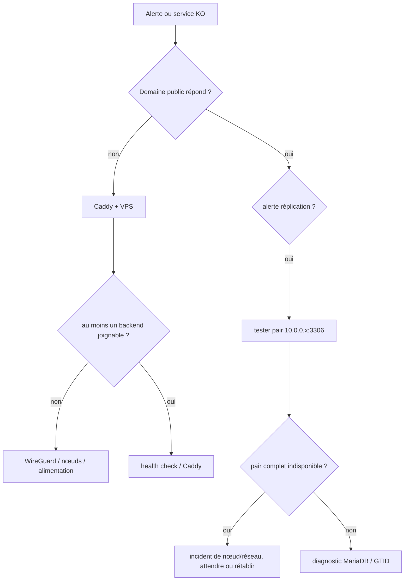

# Incidents et PRA

[← Supervision](04-supervision-replication-et-coherence.md) · [README](../README.md) · [Historique / REX →](06-historique-decisions-et-rex.md)

Cette page regroupe les **runbooks d'incident** et la **reconstruction après perte
d'un nœud**. Les REX historiques sont volontairement séparés dans la page suivante :
ici, on cherche une procédure exploitable pendant un incident, pas le récit d'un
incident passé.

## Règle de base : diagnostic avant modification

En cas de panne :

1. identifier quel composant est réellement indisponible ;
2. vérifier le réseau/WireGuard avant d'accuser MariaDB ;
3. ne jamais « réparer » la réplication par saut d'événement sans comprendre le GTID et l'erreur ;
4. ne pas relancer un slave safety-stoppé avant d'avoir établi que la réplication et la cohérence sont sûres ;
5. conserver des dumps avant toute opération corrective sur les données ;
6. si les deux nœuds ont accepté des écritures indépendantes, traiter la situation comme une divergence jusqu'à preuve du contraire.

## Arbre de décision rapide



> [!CAUTION]
> La réplication active n'est pas une sauvegarde. Une reconstruction complète à partir
> d'une perte simultanée ou d'une corruption propagée restera incomplète tant qu'une
> vraie stratégie de backup versionnée n'aura pas été déployée et testée.
## Incident — master indisponible

### Objectif

Maintenir le service sur le slave et déterminer si la panne concerne la machine, WireGuard, MariaDB ou Vaultwarden.

### Prérequis

- ne pas modifier le slave tant qu’il sert seul
- placer le monitoring en maintenance si une intervention démarre
- conserver les logs et l’heure du premier symptôme

### Commandes

```bash
# Depuis equilihost
ping -c 3 10.0.0.1
nc -vz -w 3 10.0.0.1 443

# Sur le master si accessible
systemctl --failed --no-pager
sudo wg show
sudo systemctl status mariadb docker --no-pager
sudo docker inspect vaultwarden --format '{{json .State}}'
sudo journalctl -b -p warning --no-pager
```

### Vérifications

- Caddy a basculé sur 10.0.0.2
- le slave est sain et sa réplication locale est connue
- le master n’est pas remis dans la rotation avant un healthcheck réussi

### Rollback

Si une tentative de redémarrage aggrave l’état, arrêter Vaultwarden sur le master et laisser Caddy sur le slave. Restaurer la configuration précédente puis analyser hors trafic.

### Validation finale

- [ ] Service public via slave
- [ ] Cause classée
- [ ] Master réparé isolément
- [ ] Réplication resynchronisée
- [ ] Retour master validé


## Incident — slave indisponible

### Objectif

Conserver le master en service et distinguer un safety-stop volontaire d’une panne du slave.

### Prérequis

- master sain et préféré par Caddy
- ne pas redémarrer automatiquement un slave arrêté par le monitor
- accès local utile si une coupure électrique est suspectée

### Commandes

```bash
# Depuis equilihost
ping -c 3 10.0.0.2
nc -vz -w 3 10.0.0.2 443

# Sur le slave
sudo journalctl -u vaultwarden-replication-monitor.service -n 200 --no-pager
sudo ls -la /var/lib/vaultwarden-monitor 2>/dev/null
sudo wg show
sudo systemctl status mariadb docker --no-pager
sudo docker ps -a --filter name=vaultwarden
```

### Vérifications

- présence d’une alerte de divergence ou d’un marqueur d’arrêt
- état électrique/boot du Raspberry Pi
- master sain et répliquant avant toute remise en service du slave

### Rollback

Si la raison de l’arrêt n’est pas comprise, laisser le conteneur slave arrêté. Réparer la réplication et comparer les bases avant `docker start`.

### Validation finale

- [ ] Master assure le service
- [ ] Origine arrêt/panne identifiée
- [ ] Base slave comparée
- [ ] Réplication saine
- [ ] Slave remis en rotation explicitement


## Incident — VPS indisponible

### Objectif

Rétablir le point d’entrée public sans modifier inutilement les backends sains.

### Prérequis

- confirmer que l’incident est limité à equilihost
- console/VNC du fournisseur disponible
- copie privée de WireGuard et Caddy
- ne pas publier directement les backends en solution improvisée

### Commandes

```bash
# Sur les backends
sudo wg show
sudo systemctl is-active mariadb docker
sudo mariadb -e "SHOW SLAVE STATUS\G" | grep -E \
  'Slave_IO_Running|Slave_SQL_Running|Seconds_Behind_Master'

# Sur equilihost via console
systemctl --failed --no-pager
ip -brief address
sudo systemctl status wg-quick@wg0 caddy --no-pager
sudo caddy validate --config /etc/caddy/Caddyfile
```

### Vérifications

- backends encore sains entre eux ou impact du routage identifié
- DNS public toujours correct
- interfaces réseau publiques et WireGuard présentes
- certificats Caddy disponibles

### Rollback

Si le dernier changement Caddy/WireGuard est en cause, restaurer les fichiers précédents et redémarrer seulement les services concernés. Sinon suivre la reconstruction VPS.

### Validation finale

- [ ] Backends préservés
- [ ] Connectivité VPS revenue
- [ ] Caddy actif
- [ ] Certificat valide
- [ ] Accès client confirmé


## Incident — aucun upstream Caddy

### Objectif

Expliquer et corriger un HTTP 503 `no upstreams available` en testant chaque backend séparément.

### Prérequis

- ne pas supposer que Caddy est fautif
- filtrer access_token avant de partager les logs
- horodater les transitions UP/DOWN

### Commandes

```bash
sudo journalctl -u caddy --since -30min --no-pager | \
  sed -E 's/(access_token=)[^&" ]+/\1<REDACTED>/g' | \
  grep -E '10\.0\.0\.[12]:443|no upstreams'
curl -k -I --connect-timeout 3 https://10.0.0.1:443/
curl -k -I --connect-timeout 3 https://10.0.0.2:443/
sudo wg show
```

### Vérifications

- timeout réseau versus connexion refusée
- au moins un backend réellement healthy
- health_path répond avec le code attendu
- pas de blocage UDP/51820 en amont

### Rollback

Ne pas retirer les health checks pour faire disparaître le 503. Corriger le tunnel ou le backend ; restaurer le Caddyfile antérieur seulement si la validation démontre une régression.

### Validation finale

- [ ] Cause de chaque upstream connue
- [ ] Backend sain disponible
- [ ] Caddy observe host is up
- [ ] 503 disparu
- [ ] Logs nettoyés


## Incident — tunnel WireGuard indisponible

### Objectif

Rétablir le tunnel sans confondre interface absente, service non activé, endpoint bloqué et interface déjà créée.

### Prérequis

- console de secours si le nœud distant n’est plus joignable
- wg0.conf privé sauvegardé
- aucune clé copiée dans un ticket ou un log public

### Commandes

```bash
ip link show wg0
sudo wg show
systemctl is-enabled wg-quick@wg0
systemctl status wg-quick@wg0 --no-pager
sudo journalctl -u wg-quick@wg0 -b --no-pager
sudo ss -lunp | grep 51820
sudo ufw status verbose
```

### Vérifications

- interface absente ou déjà existante
- service enabled
- UDP/51820 autorisé en IPv4/IPv6 selon le chemin
- endpoint correct et handshake récent

### Rollback

Si `wg0 already exists`, ne régénérer aucune clé : arrêter proprement l’interface manuelle puis démarrer l’unité. Si le firewall est en cause, restaurer uniquement la règle validée.

### Validation finale

- [ ] Interface gérée par systemd
- [ ] Handshake rétabli
- [ ] Ping 10.0.0.x réussi
- [ ] TCP/443 et 3306 rétablis
- [ ] Services dépendants sains


## Incident — réplication MariaDB cassée

### Objectif

Stopper l’aggravation, collecter l’état exact des deux directions et ne redémarrer que les threads sûrs.

### Prérequis

- activer le mode maintenance
- si les deux backends ont accepté des écritures, traiter comme split-brain
- prendre des dumps avant une modification

### Commandes

```bash
sudo touch /etc/vaultwarden-monitor/maintenance
sudo mariadb -e "SHOW SLAVE STATUS\G" > /tmp/slave-status.txt
sudo mariadb -NBe "SELECT @@server_id, @@gtid_slave_pos, @@gtid_binlog_pos, @@gtid_current_pos;"
sudo mariadb-dump --single-transaction --routines --events --triggers \
  vaultwarden | gzip > /tmp/vaultwarden-incident.sql.gz
sha256sum /tmp/vaultwarden-incident.sql.gz
```

### Vérifications

- IO et SQL séparément
- Last_IO_Error et Last_SQL_Error complets
- GTID des deux nœuds
- écritures possibles pendant la coupure
- état du conteneur slave

### Rollback

Un simple `START SLAVE` est acceptable seulement lorsque la configuration existe, qu’aucune erreur de données n’est présente et qu’aucune divergence n’est possible. Sinon laisser les threads arrêtés. Ne pas utiliser de skip automatique.

### Validation finale

- [ ] Écritures maîtrisées
- [ ] Deux états collectés
- [ ] Dumps créés
- [ ] Cause classée réseau/configuration/données
- [ ] Reprise validée dans les deux sens


## Incident — split-brain

### Objectif

Figer deux bases ayant accepté des écritures divergentes, produire un rapport et choisir une résolution sans suppression automatique.

### Prérequis

- arrêter au minimum le conteneur slave ; si la divergence continue, arrêter les deux
- activer la maintenance
- prendre un dump indépendant de chaque base
- ne jamais relancer la réplication avant comparaison

### Commandes

```bash
sudo docker stop vaultwarden
sudo mariadb -e "STOP SLAVE;"
sudo mariadb-dump --single-transaction --routines --events --triggers \
  vaultwarden | gzip > /tmp/vaultwarden-$(hostname)-split-brain.sql.gz
sha256sum /tmp/vaultwarden-*-split-brain.sql.gz

# Depuis le nœud d’analyse, lecture seule
sudo /opt/reconcile_split_brain.sh /root/reconcile-$(date +%F-%H%M)
```

### Vérifications

- rapport par table relu
- lignes propres au master et au slave identifiées
- dates métiers interprétées avec prudence
- fichiers locaux sends/attachments comparés séparément

### Rollback

Le rollback consiste à conserver les deux originaux intacts. Toute application SQL doit d’abord être testée sur des copies. Si un doute subsiste, promouvoir une base de référence et importer manuellement les données uniques validées.

### Validation finale

- [ ] Deux bases figées et sauvegardées
- [ ] Rapport produit sans --apply
- [ ] Décision de référence documentée
- [ ] Fusion testée hors production
- [ ] Réplication reconstruite après validation


## Incident — divergence de données

### Objectif

Comparer deux bases ou compteurs différents sans conclure trop vite à une perte ni écraser le nœud le plus riche.

### Prérequis

- aucune réplication active pendant l’analyse si elle peut propager une mauvaise correction
- dumps frais datés et hashés
- tables et schémas comparables
- comptes de lecture seule

### Commandes

```bash
sudo mariadb -NBe "SELECT COUNT(*) FROM vaultwarden.users;"
sudo mariadb -NBe "SELECT COUNT(*) FROM vaultwarden.ciphers;"
sudo mariadb -e "SHOW CREATE TABLE vaultwarden.ciphers\G"
sudo /opt/reconcile_split_brain.sh /root/reconcile-$(date +%F-%H%M)
less /root/reconcile-*/report.txt
```

### Vérifications

- différence de compte versus différence de lignes
- schémas identiques, notamment UUID VARCHAR(36)
- lignes les plus récentes et données uniques des deux côtés
- aucun secret exposé dans les rapports

### Rollback

Ne pas exécuter les fichiers `apply_to_*.sql` tant qu’ils n’ont pas été relus et testés. Les conserver comme proposition ; restaurer les dumps de laboratoire si le test produit un résultat inattendu.

### Validation finale

- [ ] Comptages consignés
- [ ] Schémas comparés
- [ ] Rapport ligne à ligne relu
- [ ] Décision approuvée
- [ ] Résultat final re-comparé


## Incident — Send ou pièce jointe manquant

### Objectif

Retrouver un fichier local absent du backend choisi alors que sa métadonnée existe en base.

### Prérequis

- ne pas supprimer la ligne MariaDB
- identifier le backend qui a reçu l’upload
- préserver les deux /vw-data
- éviter un rsync avec suppression

### Commandes

```bash
sudo find /vw-data/sends /vw-data/attachments -type f -printf '%p %s bytes\n' 2>/dev/null
sudo mariadb vaultwarden -e "
SELECT uuid, atype, creation_date, deletion_date, disabled
FROM sends;"
sudo rsync -an --itemize-changes \
  /vw-data/sends/ <UTILISATEUR>@10.0.0.2:/vw-data/sends/
```

### Vérifications

- fichier présent sur un seul nœud
- taille et hash identiques avant copie
- permissions compatibles
- test via Caddy après copie

### Rollback

Avant toute copie réelle, conserver une sauvegarde des répertoires cibles. Copier sans `--delete`, puis restaurer le fichier précédent si le test échoue.

### Validation finale

- [ ] Métadonnée identifiée
- [ ] Copie source trouvée
- [ ] Hash vérifié
- [ ] Copie sans suppression
- [ ] Téléchargement via URL publique validé


## Incident — perte d’un disque

### Objectif

Isoler le nœud défaillant, maintenir le service restant et reconstruire sans supposer que la réplication couvre tous les fichiers.

### Prérequis

- ne pas multiplier les redémarrages d’un disque en erreur
- identifier le nœud sain
- disposer d’une sauvegarde externe ou accepter les limites actuelles
- nouveau support validé

### Commandes

```bash
sudo dmesg -T | grep -Ei 'I/O error|ext4|nvme|mmc|reset'
sudo smartctl -a /dev/<DISQUE> 2>/dev/null
sudo docker stop vaultwarden
sudo systemctl stop mariadb
sudo lsblk -f
```

### Vérifications

- nature matérielle ou filesystem
- données MariaDB disponibles sur l’autre nœud
- fichiers /vw-data uniques potentiellement perdus
- Caddy n’envoie plus de trafic au nœud

### Rollback

Le rollback d’un remplacement de disque n’est pas garanti. Ne remonter l’ancien support qu’en lecture seule pour récupération. Revenir au nœud sain comme source de vérité.

### Validation finale

- [ ] Nœud isolé
- [ ] Service assuré par l’autre backend
- [ ] Périmètre de perte établi
- [ ] Reconstruction suivie
- [ ] Sauvegarde/PRA mis à jour après incident


## Stratégie PRA

### Objectif

Définir une reprise manuelle réaliste et rendre visibles les éléments encore absents.

### Prérequis

- 🟠 aucun backup périodique n’est actuellement déployé
- les procédures sont des cadres à tester, pas une promesse de restauration
- définir RPO et RTO avant de choisir les outils

### Commandes

```bash
# Inventaire minimal à protéger
sudo mariadb-dump --single-transaction --routines --events --triggers vaultwarden
sudo find /vw-data -maxdepth 2 -type f
sudo find /etc/wireguard /etc/caddy /etc/systemd/system \
  -maxdepth 2 -type f 2>/dev/null
sudo docker inspect vaultwarden
```

### Vérifications

- base MariaDB
- sends et attachments
- clés RSA et TLS
- configs Docker, WireGuard, Caddy, MariaDB et monitoring
- secrets sauvegardés séparément et chiffrés

### Rollback

Une stratégie n’a pas de rollback. Si le plan n’est pas testé, le marquer explicitement non opérationnel et ne supprimer aucun ancien moyen de reprise.

### Validation finale

- [ ] RPO défini
- [ ] RTO défini
- [ ] Sauvegarde hors site choisie
- [ ] Rétention choisie
- [ ] Test de restauration planifié
- [ ] Responsable de décision identifié


## PRA — reconstruction du master

### Objectif

Recréer bitwarden-master sur une machine vierge pendant que le slave porte le service.

### Prérequis

- slave déclaré source de vérité et figé le temps du dump
- Caddy maintenu sur le slave
- nouveau système préparé
- clés/secrets disponibles hors Git

### Commandes

```bash
sudo hostnamectl set-hostname bitwarden-master
# Suivre les pages Build : WireGuard, MariaDB, Docker, Vaultwarden
sudo install -m 644 configs/mariadb/bitwarden-master/50-server.cnf \
  /etc/mysql/mariadb.conf.d/50-server.cnf
sudo systemctl restart mariadb
# Importer une copie validée du slave, puis configurer chaque sens de réplication
sudo mariadb -e "SHOW SLAVE STATUS\G"
sudo docker-compose up -d
```

### Vérifications

- master 10.0.0.1 joignable
- server_id=1 et offset master
- base importée sans divergence
- réplication Yes/Yes des deux côtés
- Caddy ne le réintègre qu’après healthcheck

### Rollback

Arrêter Vaultwarden sur le nouveau master, stopper sa réplication et continuer sur le slave. Détruire seulement l’environnement neuf après conservation des logs et dumps.

### Validation finale

- [ ] Master reconstruit
- [ ] Données restaurées
- [ ] Réplication bidirectionnelle saine
- [ ] Fichiers locaux nécessaires restaurés
- [ ] Retour Caddy validé


## PRA — reconstruction du slave

### Objectif

Recréer bitwarden-slave à partir du master sain sans l’autoriser à recevoir du trafic trop tôt.

### Prérequis

- master source de vérité
- Caddy reste sur le master
- safety-stop désactivé pendant le build puis rétabli
- prendre en compte le support Raspberry Pi/ARM64

### Commandes

```bash
sudo hostnamectl set-hostname bitwarden-slave
sudo install -m 644 configs/mariadb/bitwarden-slave/50-server.cnf \
  /etc/mysql/mariadb.conf.d/50-server.cnf
sudo systemctl restart mariadb
# Importer la base de référence, configurer la réplication, puis :
sudo mariadb -e "SHOW SLAVE STATUS\G"
sudo docker-compose up -d
sudo touch /etc/vaultwarden-monitor/maintenance
```

### Vérifications

- server_id=2 et offset slave
- mêmes clés RSA et paramètres applicatifs
- réplication rattrapée avant trafic
- fichiers sends/attachments restaurés ou limite explicitement acceptée

### Rollback

Maintenir le nouveau slave hors rotation et conteneur arrêté. Le master continue seul ; corriger ou recommencer le build sans modifier sa base.

### Validation finale

- [ ] Slave reconstruit
- [ ] Réplication saine
- [ ] Monitoring installé avec common.sh
- [ ] Safety-stop autorisé seulement sur slave
- [ ] Bascule Caddy testée


## PRA — reconstruction du VPS

### Objectif

Recréer equilihost, le tunnel et Caddy lorsque le point d’entrée public est perdu.

### Prérequis

- accès au DNS et au fournisseur
- endpoints/clé WireGuard privés
- Caddyfile nettoyé plus éventuels autres vhosts conservés dans une sauvegarde privée
- backends sains

### Commandes

```bash
sudo hostnamectl set-hostname equilihost
sudo install -m 600 configs/wireguard/equilihost/wg0.conf.example \
  /etc/wireguard/wg0.conf
sudo systemctl enable --now wg-quick@wg0
sudo install -m 644 configs/caddy/Caddyfile /etc/caddy/Caddyfile
sudo caddy validate --config /etc/caddy/Caddyfile
sudo systemctl enable --now caddy
```

### Vérifications

- 10.0.0.10 présent
- deux handshakes WireGuard
- routage master↔slave si requis
- DNS vers la nouvelle IP publique
- certificat ACME obtenu
- deux upstreams testés

### Rollback

Restaurer le DNS vers l’ancien VPS s’il existe encore. Désactiver Caddy sur le nouveau tant que les certificats ou tunnels ne sont pas sains.

### Validation finale

- [ ] WireGuard reconstruit
- [ ] Caddy validé
- [ ] DNS convergé
- [ ] TLS public valide
- [ ] Failover backends testé


## PRA — migration d’un nœud

### Objectif

Migrer un backend vers une nouvelle machine en utilisant l’autre nœud pour assurer le service.

### Prérequis

- ne migrer qu’un nœud à la fois
- réplication saine avant début
- inventaire des fichiers locaux
- chevauchement d’adresses WireGuard évité

### Commandes

```bash
sudo touch /etc/vaultwarden-monitor/maintenance
sudo docker stop vaultwarden
sudo mariadb-dump --single-transaction --routines --events --triggers \
  vaultwarden | gzip > /tmp/vaultwarden-migration.sql.gz
sudo tar -czf /tmp/vw-data-migration.tar.gz /vw-data
sha256sum /tmp/vaultwarden-migration.sql.gz /tmp/vw-data-migration.tar.gz
```

### Vérifications

- Caddy sert l’autre backend
- dumps et archives transférés/chiffrés
- nouvelle machine testée hors rotation
- ancienne machine conservée éteinte mais récupérable pendant la période de validation

### Rollback

Réactiver l’ancienne machine avec ses fichiers initiaux seulement après avoir isolé la nouvelle. Ne jamais faire fonctionner simultanément deux nœuds avec le même server_id ou la même IP WireGuard.

### Validation finale

- [ ] Ancien nœud sorti proprement
- [ ] Nouveau nœud unique
- [ ] Données et fichiers restaurés
- [ ] Réplication saine
- [ ] Période d’observation terminée


## PRA — validation après reconstruction

### Objectif

Décider si un nœud reconstruit peut reprendre du trafic et clôturer le PRA avec des preuves.

### Prérequis

- toutes les étapes de reconstruction journalisées
- aucun test avec des secrets réels non nécessaires
- fenêtre de bascule

### Commandes

```bash
systemctl --failed --no-pager
sudo wg show
sudo systemctl is-active mariadb docker
sudo mariadb -e "SHOW SLAVE STATUS\G"
sudo docker inspect vaultwarden \
  --format '{{.State.Status}} {{if .State.Health}}{{.State.Health.Status}}{{end}}'
curl -k -I https://10.0.0.1:443/
curl -I https://vaultwarden.example.com/
```

### Vérifications

- horloge et réseau
- deux directions MariaDB
- schémas et compteurs
- fichiers locaux utiles
- healthcheck Caddy
- connexion et écriture de test
- alertes du monitoring

### Rollback

Retirer immédiatement le nœud reconstruit de la rotation s’il échoue. Revenir au nœud sain ; conserver l’environnement fautif pour diagnostic.

### Validation finale

- [ ] Services sans échec
- [ ] WireGuard stable
- [ ] Réplication Yes/Yes
- [ ] Caddy voit le nœud UP
- [ ] Test applicatif réussi
- [ ] PRA horodaté et RPO/RTO consignés

## Cas particulier : coupure électrique du slave

`bitwarden-slave` étant hébergé sur un Raspberry Pi avec SSD, une microcoupure peut
avoir plusieurs effets : reboot propre, reboot incomplet, contrôleur/SSD mal
réinitialisé ou nœud restant indisponible jusqu'à un vrai power-cycle. Dans ce cas,
les erreurs de réplication reçues par le master (`IO Connecting`, erreur 2003,
`Seconds_Behind_Master=NULL`) sont des **conséquences de l'absence du pair**.

Ordre de contrôle après retour physique du slave :

```bash
uptime
systemctl --failed --no-pager
sudo vcgencmd get_throttled 2>/dev/null || true
sudo dmesg -T | grep -Ei 'under.?voltage|voltage|usb|uas|scsi|reset|error|ext4|I/O|timeout|watchdog'
sudo wg show
sudo systemctl status mariadb docker --no-pager
sudo docker ps
```

Ne toucher à la réplication qu'après avoir confirmé que le nœud, WireGuard et
MariaDB sont réellement revenus. La protection électrique du slave (UPS 230 V +
USB/NUT, éventuellement watchdog et power-cycle distant) figure dans la feuille de
route.

## Validation de clôture d'incident

- [ ] cause ou périmètre de la panne identifié ;
- [ ] les deux nœuds ont une heure correcte et WireGuard est stable ;
- [ ] réplication IO/SQL `Yes` dans les deux sens ;
- [ ] aucun lag indéterminable ;
- [ ] Vaultwarden répond sur les deux backends ;
- [ ] Caddy voit les upstreams attendus ;
- [ ] les fichiers applicatifs concernés ont été vérifiés ;
- [ ] l'incident de monitoring est passé en récupération ;
- [ ] si l'incident révèle une faiblesse structurelle, une action est ajoutée à la roadmap.

## Navigation

[← Supervision](04-supervision-replication-et-coherence.md) · [Historique, décisions et REX →](06-historique-decisions-et-rex.md)
