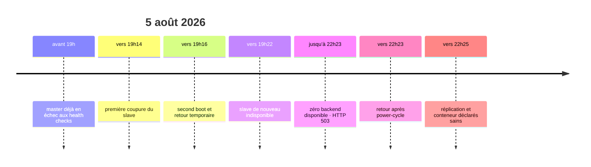

# Historique, décisions d'architecture et REX

[← Incidents / PRA](05-incidents-et-pra.md) · [README](../README.md) · [Axes d'amélioration →](07-axes-d-amelioration.md)

Cette page conserve **le pourquoi** derrière l'infrastructure. Elle rassemble la
chronologie, les décisions structurantes et les retours d'expérience. Contrairement
aux runbooks, elle n'est pas conçue pour être suivie ligne par ligne pendant une
panne : elle sert à comprendre les compromis, les erreurs passées et les raisons des
choix actuels.

Les décisions sont conservées au format ADR (`Contexte → Décision → Conséquences →
Alternatives`) mais réunies dans un même document pour éviter la multiplication de
petits fichiers.
## Chronologie du projet

| Date | Événement | Résultat |
|---|---|---|
| avant juillet 2026 | migration historique SQLite vers MariaDB et mise en place de la réplication bidirectionnelle | schémas hérités et anciens fichiers SQLite conservés |
| 15 juillet 2026 | incident fournisseur et premier reboot d’`equilihost` | WireGuard remonté manuellement puis unité activée au démarrage |
| juillet 2026 | mise à jour Vaultwarden 1.35.8→1.36.0 | correction de collation/UUID, faux positif du script d’update identifié |
| juillet 2026 | découverte d’utilisateurs/données répartis entre les deux bases | analyse d’un split-brain et reconstruction de la réplication |
| 25–26 juillet 2026 | déploiement du monitoring et premiers tests | alertes mail, safety-stop du slave, contrôle quotidien et reconcile |
| 27 juillet 2026 | redémarrage du slave après coupure | alertes de pair injoignable ; retour après reprise MariaDB/WireGuard |
| 5 août 2026 | master injoignable par Caddy + deux coupures électriques du slave | période sans upstream et HTTP 503 |
| 10 août 2026 | revue réseau du master | règle UFW UDP/51820 ajoutée ; master de nouveau visible |
| 10 août 2026 | mise à jour Vaultwarden 1.37.1 | script d’update validé sur slave puis master |
| 12–13 août 2026 | revue technique complète des trois nœuds | limites stockage, sécurité, Caddy, backups et PRA documentées |

L’historique Git futur doit conserver les changements, mais cette page garde la logique causale et les décisions qui ne se lisent pas dans un diff.


## ADR-001 — réplication MariaDB bidirectionnelle

- **Statut :** Acceptée, à sécuriser
- **Date de formalisation :** août 2026

### Contexte

Les deux sites doivent pouvoir accepter des écritures lorsque Caddy bascule. Une réplication unidirectionnelle laisserait le backend secondaire en lecture seule ou imposerait une promotion manuelle.

### Décision

Maintenir deux MariaDB 10.11 locales en réplication GTID dans les deux sens, avec `server_id` et offsets d’auto-incrément distincts.

### Conséquences positives

- continuité d’écriture lors de la perte d’un backend
- base locale pour chaque Vaultwarden
- pas de dépendance à une base centrale unique

### Conséquences négatives et risques

- risque de split-brain si la réplication casse
- complexité de réconciliation
- les suppressions et corruptions peuvent se propager

### Alternatives considérées

- réplication primaire→réplique avec promotion manuelle
- MariaDB Galera
- base unique externe
- stockage/DB managés

### Liens

- [Architecture MariaDB](01-architecture-et-conception.md)
- [REX split-brain](06-historique-decisions-et-rex.md)


## ADR-002 — failover master/slave par Caddy

- **Statut :** Acceptée
- **Date de formalisation :** août 2026

### Contexte

Deux backends sont disponibles, mais un routage aléatoire augmente les écritures simultanées et expose plus souvent les différences de stockage local.

### Décision

Utiliser Caddy sur `equilihost` avec `lb_policy first`, le master en premier et le slave en second, health checks toutes les cinq secondes.

### Conséquences positives

- chemin normal déterministe
- bascule automatique rapide
- réduction des accès au stockage local du slave

### Conséquences négatives et risques

- le slave reste inscriptible en bascule
- équilihost reste un SPOF
- retour automatique au master dès qu’il paraît sain

### Alternatives considérées

- round-robin actif/actif
- bascule manuelle
- load balancer managé
- DNS failover

### Liens

- [Haute disponibilité](01-architecture-et-conception.md)
- [Caddy](01-architecture-et-conception.md)


## ADR-003 — safety-stop du slave

- **Statut :** Acceptée
- **Date de formalisation :** août 2026

### Contexte

Le split-brain historique a montré que la disponibilité apparente pouvait masquer une divergence durable. Un coffre de mots de passe privilégie l’intégrité.

### Décision

Autoriser les scripts à arrêter automatiquement Vaultwarden uniquement sur `bitwarden-slave` après anomalie critique persistante ou divergence confirmée. Le redémarrage reste manuel.

### Conséquences positives

- limite les nouvelles écritures divergentes
- conserve toujours le master sous contrôle humain
- force une validation avant retour du slave

### Conséquences négatives et risques

- peut réduire la disponibilité si le master est déjà indisponible
- dépend de la qualité des détections
- nécessite des procédures et alertes fiables

### Alternatives considérées

- alerte sans action
- arrêt des deux nœuds
- promotion/élection automatique
- réparation SQL automatique

### Liens

- [Logique safety-stop](04-supervision-replication-et-coherence.md)
- [Runbook split-brain](05-incidents-et-pra.md)


## ADR-004 — WireGuard inter-sites

- **Statut :** Acceptée
- **Date de formalisation :** août 2026

### Contexte

Les trois machines résident sur des réseaux et sites différents. Les flux applicatifs internes et MariaDB ne doivent pas être publiés directement.

### Décision

Utiliser une topologie WireGuard en étoile autour d’`equilihost`, avec `10.0.0.1`, `10.0.0.2` et `10.0.0.10`.

### Conséquences positives

- chiffrement inter-sites
- adressage stable indépendant des LAN
- surface publique réduite
- flux Caddy et MariaDB homogènes

### Conséquences négatives et risques

- le routage inter-backends dépend du VPS
- les endpoints/firewalls doivent rester cohérents
- une interface non activée au boot coupe plusieurs couches

### Alternatives considérées

- VPN des box Internet
- tunnel direct uniquement master↔slave
- réseau overlay tiers
- publication TLS/mTLS sans VPN

### Liens

- [Infrastructure réseau](01-architecture-et-conception.md)
- [Runbook WireGuard](05-incidents-et-pra.md)


## ADR-005 — terminaison TLS centralisée sur Caddy

- **Statut :** Acceptée, chaîne backend à améliorer
- **Date de formalisation :** août 2026

### Contexte

Les clients doivent utiliser une URL unique et des certificats publics renouvelés automatiquement. Les backends ne sont pas exposés.

### Décision

Terminer TLS public sur Caddy, puis utiliser HTTPS dans WireGuard vers les deux Vaultwarden. La production actuelle utilise des certificats backend auto-signés avec vérification désactivée côté Caddy.

### Conséquences positives

- un seul point de gestion ACME
- URL et issuer Vaultwarden cohérents
- health checks et failover intégrés

### Conséquences négatives et risques

- équilihost devient critique
- `tls_insecure_skip_verify` ne vérifie pas l’identité backend
- certificats et logs Caddy concentrent des données sensibles

### Alternatives considérées

- TLS terminé directement sur chaque backend
- HTTP simple dans WireGuard
- autorité privée avec vérification stricte
- reverse proxy managé

### Liens

- [Reverse proxy Caddy](01-architecture-et-conception.md)
- [Installation Caddy](02-mise-en-oeuvre-et-reconstruction.md)


## REX — divergence MariaDB / split-brain

### Contexte

Les deux Vaultwarden acceptaient des écritures tandis que la réplication bidirectionnelle n’était plus saine. L’apparence du service restait normale, ce qui a permis à la divergence de durer environ deux semaines avant détection.

### Symptômes et impact

- nombres de `ciphers` différents entre master et slave ;
- comptes et éléments uniques sur chacun des nœuds ;
- risque de perdre les données du « mauvais » côté lors d’une reconstruction ;
- absence initiale d’alerte automatique.

### Cause

La cause technique initiale complète n’a pas été prouvée dans le corpus. En revanche, la condition aggravante est certaine : deux backends inscriptibles sont restés actifs alors que la réplication était cassée.

### Résolution

Les deux bases ont été comparées, des données uniques ont été identifiées, une base de référence a été choisie et la réplication a été reconstruite. Les schémas hérités de SQLite, notamment certaines colonnes UUID, ont aussi nécessité des corrections.

### Enseignements

1. `SHOW SLAVE STATUS` doit être contrôlé dans les deux sens.
2. « Réplication redémarrée » ne signifie pas « données fusionnées ».
3. Une différence de compte est un signal, pas une preuve suffisante.
4. Aucune correction automatique ne doit ignorer une erreur SQL.
5. Le slave doit cesser d’accepter des écritures en cas de divergence confirmée.

### Actions issues du REX

- monitoring toutes les cinq minutes ;
- comparaison quotidienne de douze tables ;
- réconciliation détaillée quotidienne avec double confirmation ;
- alertes mail et safety-stop du slave ;
- runbooks séparés pour réplication cassée, divergence et split-brain.


## REX — master invisible derrière WireGuard

### Contexte

Caddy fonctionnait et le slave servait le trafic, mais le master restait déclaré indisponible pendant une longue période. Cette panne silencieuse réduisait l’architecture à un seul backend réel.

### Symptômes

- health checks Caddy vers `10.0.0.1:443` en timeout ;
- handshake WireGuard du master ancien ;
- slave toujours accessible ;
- plusieurs `no upstreams available` dès que le slave flappait.

### Cause retenue

Le firewall UFW du master bloquait le trafic WireGuard attendu. L’ouverture explicite d’UDP/51820 a rétabli le tunnel et l’accès backend.

### Correction

```bash
sudo ufw allow 51820/udp
sudo ufw status verbose
sudo wg show
```

La commande réelle a ajouté les règles IPv4 et IPv6. Les endpoints publics sont volontairement absents de ce document.

### Enseignements

- une application accessible ne prouve pas que la redondance est saine ;
- Caddy doit être surveillé par upstream et pas seulement par URL publique ;
- le dernier handshake WireGuard est un indicateur opérationnel essentiel ;
- les firewalls hôte doivent faire partie du référentiel et du test après reboot.

### Actions

- [x] règle WireGuard master ajoutée ;
- [ ] test synthétique régulier des deux backends depuis `equilihost` ;
- [ ] revue firewall documentée des trois nœuds.


## REX — indisponibilité du 5 août 2026

### Résumé

Deux défaillances indépendantes se sont superposées : le master était déjà inaccessible depuis `equilihost` à cause du tunnel/firewall, puis le slave a subi deux coupures électriques rapprochées et un état anormal nécessitant un power-cycle manuel.

### Chronologie reconstituée



Les journaux du Raspberry Pi présentaient des heures initiales incohérentes : sans horloge RTC fiable, le système démarrait avec une ancienne heure puis NTP corrigeait l’horloge. Les événements Caddy et les changements de boot ont permis de recaler la séquence.

### Impact

Caddy a correctement servi le slave tant qu’il était disponible, puis a renvoyé `503 no upstreams available` lorsque les deux backends étaient indisponibles.

### Ce qui n’a pas causé l’incident

Le monitoring du slave n’a pas exécuté de safety-stop le 5 août. Le marqueur trouvé datait d’un test antérieur. Caddy a réagi conformément à sa configuration.

### Enseignements et actions

- [x] réparer le tunnel du master ;
- [ ] protéger le slave Raspberry Pi + SSD par un onduleur ;
- [ ] surveiller séparément chaque upstream ;
- [ ] formaliser la reconstruction du VPS et des backends ;
- [ ] mettre en place des sauvegardes, car la HA a une limite commune.

## REX — coupures électriques récurrentes du slave en août 2026

Après l'incident du 5 août, le slave a de nouveau connu une indisponibilité à la
suite d'un épisode électrique. Le master a correctement remonté l'impossibilité de
joindre `10.0.0.2:3306` et a maintenu son propre service. Le rappel quotidien a été
envoyé tant que l'incident restait actif.

### Enseignement

Le failover logiciel ne protège pas un équipement contre une alimentation instable.
Le fait d'avoir deux sites indépendants est un avantage majeur, mais chaque site doit
rester suffisamment fiable pour que la redondance soit réellement disponible quand
on en a besoin. Sur le slave, la priorité matérielle devient donc l'absorption des
microcoupures et l'arrêt propre en cas de coupure longue.

### Actions associées

- UPS 230 V dimensionné pour Raspberry Pi + SSD ;
- communication USB HID/NUT pour connaître l'état secteur/batterie ;
- arrêt propre sur batterie faible ;
- étude du watchdog matériel ;
- possibilité de power-cycle distant en dernier recours ;
- test réel « perte secteur → batterie → retour secteur → reprise complète ».

## Ce que les incidents ont changé dans la conception

Les incidents ne sont pas conservés pour « montrer les problèmes », mais pour
expliquer pourquoi certaines protections existent aujourd'hui :

- le split-brain a conduit à préférer la résurrection prudente d'une donnée ambiguë à
  une suppression potentiellement irréversible ;
- le safety-stop du slave traduit le choix cohérence > disponibilité en cas de doute ;
- l'incident WireGuard a montré qu'une règle firewall manquante pouvait rendre la
  redondance théorique mais inutilisable ;
- la divergence d'un Send a montré que la réplication SQL ne couvre pas les fichiers ;
- les coupures électriques du slave ont mis en évidence qu'une architecture multi-site
  reste dépendante de la qualité d'alimentation de chacun de ses nœuds.

## Navigation

[← Incidents et PRA](05-incidents-et-pra.md) · [Axes d'amélioration →](07-axes-d-amelioration.md)
