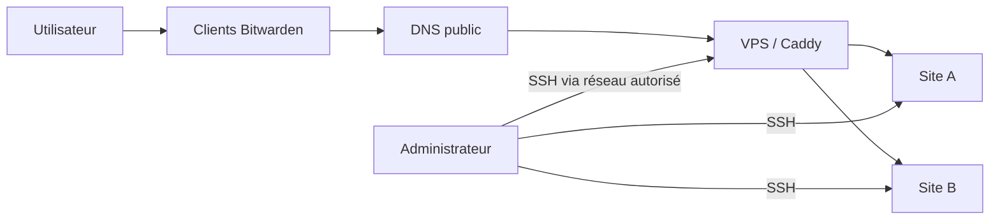
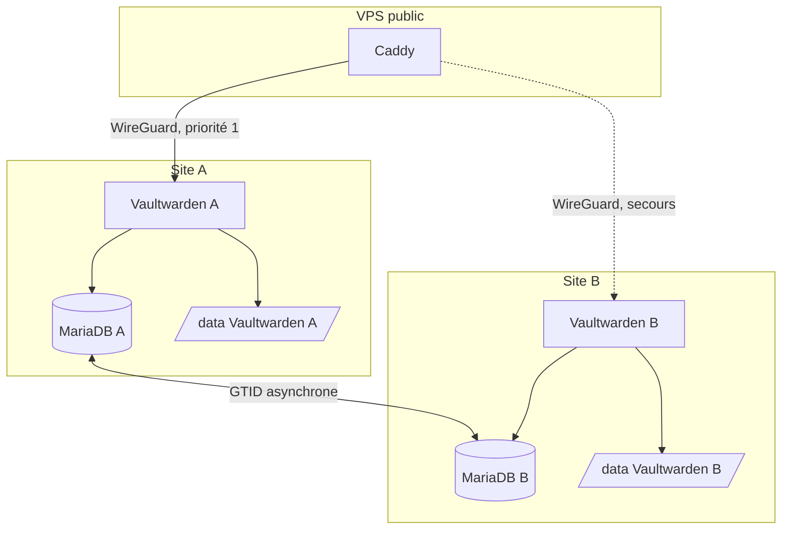

# Architecture applicative et infrastructure

## 1. Objectifs

L'infrastructure doit fournir :

- un accès HTTPS depuis les clients Bitwarden ;
- aucune exposition directe des nœuds domestiques ;
- une base locale sur chaque nœud ;
- un chemin de basculement vers un second site ;
- des sauvegardes indépendantes de la réplication ;
- des procédures compréhensibles en cas de panne.

## 2. Vues d'architecture

### Vue contexte

### Vue conteneurs

### Vue réseau

| Hôte | Adresse WireGuard d'exemple | Services privés |
| --- | --- | --- |
| Nœud A | `10.0.0.1/32` | Vaultwarden `8080`, MariaDB `3306` |
| Nœud B | `10.0.0.2/32` | Vaultwarden `8080`, MariaDB `3306` |
| VPS | `10.0.0.10/32` | Caddy vers les nœuds |

Les ports applicatifs sont liés à l'adresse WireGuard. Ils ne doivent pas écouter sur `0.0.0.0` côté hôte, sauf décision consciente et filtrage strict.

## 3. Composants

### Vaultwarden

Vaultwarden expose l'API compatible avec les clients Bitwarden et le coffre Web. Le répertoire `/data` reste persistant même avec MariaDB, car il peut contenir des pièces jointes, des Sends, des clés et d'autres fichiers nécessaires au service.

### MariaDB

Chaque nœud possède sa propre instance MariaDB. La configuration d'exemple active les binlogs, GTID strict, le format `ROW` et des identifiants de serveur distincts.

La réplication ne doit jamais être considérée comme une sauvegarde : une suppression logique, une corruption applicative ou une mauvaise migration peut être répliquée sur les deux nœuds.

### WireGuard

WireGuard fournit :

- le chiffrement des flux inter-sites ;
- des adresses stables indépendantes des LAN ;
- un périmètre réseau simple pour le pare-feu ;
- le transport du trafic Caddy et MariaDB.

### Caddy

Caddy termine TLS public et relaie le trafic via WireGuard. Le Caddyfile utilise :

- `lb_policy first` ;
- un contrôle actif sur `/alive` ;
- des contrôles passifs sur erreurs et latence ;
- des tentatives limitées en cas d'échec de connexion.

### Scripts d'exploitation

Les scripts sont exécutés depuis l'hôte :

- `backup_vaultwarden.sh` : dump transactionnel et archive `/data` ;
- `update_vaultwarden.sh` : backup, changement de version, healthcheck, rollback ;
- `check_replication.sh` : lecture du statut local et distant, redémarrage optionnel des threads ;
- `healthcheck.sh` : synthèse rapide.

## 4. Flux

| Source | Destination | Port | Usage |
| --- | --- | ---: | --- |
| Internet | VPS | 80/443 | ACME et HTTPS public |
| VPS WireGuard | Nœud A/B | 8080 | HTTP privé vers Vaultwarden |
| Nœud A | Nœud B | 3306 | Réplication MariaDB |
| Nœud B | Nœud A | 3306 | Réplication MariaDB |
| Administrateur | Hôtes | SSH personnalisé | Administration |

## 5. Données et persistance

### Base de données

La base contient les données métier et les métadonnées applicatives. Les secrets des coffres sont chiffrés côté client, mais la base reste hautement sensible : comptes, métadonnées, journaux et données chiffrées doivent être protégés.

### Répertoire `/data`

Le volume Vaultwarden doit être sauvegardé en même temps que la base. Une restauration cohérente réunit les deux éléments issus de la même fenêtre de sauvegarde.

### Données Caddy

Le volume de données Caddy contient notamment les certificats. Il peut être régénéré via ACME, mais sa sauvegarde accélère une reconstruction.

## 6. Disponibilité et cohérence

### Fonctionnement normal

- A sert le trafic ;
- B reçoit les transactions de A ;
- B peut aussi produire ses propres binlogs, mais il ne doit pas recevoir de trafic normal ;
- les deux scripts de contrôle vérifient leur thread de réplication local.

### Panne de A

Caddy peut sélectionner B lorsque A échoue au healthcheck. Avant de remettre A en ligne, l'administrateur vérifie :

1. la réplication ;
2. les GTID ;
3. l'absence de conflit SQL ;
4. la présence des écritures effectuées pendant le basculement.

### Partition réseau

C'est le cas le plus dangereux. Si A et B restent accessibles depuis des chemins différents, ils peuvent diverger. Le mécanisme de protection est opérationnel : retirer un nœud de la rotation et éviter toute double exposition.

## 7. RPO et RTO

Les objectifs doivent être explicitement choisis. Exemple raisonnable pour un usage personnel :

| Indicateur | Cible indicative | Dépend de |
| --- | --- | --- |
| RPO sauvegarde | 24 h maximum | fréquence des backups |
| RPO réplication | quelques secondes, non garanti | réseau et état SQL |
| RTO basculement | quelques minutes | healthchecks et disponibilité B |
| RTO reconstruction | plusieurs heures | qualité des sauvegardes et procédures |

## 8. Limites

- pas de quorum ;
- pas de fencing automatique ;
- pas de réplication native du volume `/data` ;
- basculement applicatif distinct de la cohérence base ;
- rollback d'image ne rollback pas automatiquement une migration SQL ;
- secrets stockés dans des fichiers `.env` locaux.
